# Outline

- **Organisation**: materials, approach, related lectures, registration, schedule, requirements, literature
- **Fundamentals**: models and key terms
- **Core concepts**: sign; paradigmatic vs syntagmatic; linearity
- **Linguistic domains**: phonetics, morphology, syntax etc.
- **Applied fields**: lexicography, psycholinguistics, computational
- **Summary and outlook**: key points; next week

:::: {.notes}
- 10:15–10:31: Organisation
- 10:31–10:50: Fundamentals
- 10:50–10:55: break
- 10:55–10:58: Quiz
- 11:00–11:22: Domains
- 11:22–11:26: Applied
- 11:42–11:45: Summary
::::

# Organisation

## Course materials

Course website: <https://wuqui.github.io/Intro252/>

::::: {.notes}
- 10:15–10:16
:::::

## Teaching approach: flipped classroom

- students prepare before class (readings, exercises);
- in-class time focuses on discussion and practice.

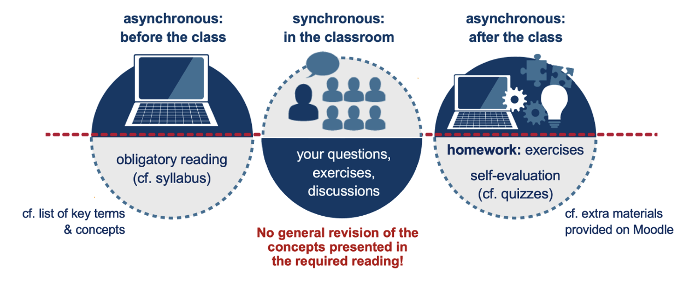

::::: {.notes}
- 10:17–10:18
:::::

## Related lectures {.small}

- **Lehramt Gymnasium**: 
  - Take 'Grundlagenvorlesung' Linguistik (P 3.2) alongside 'Einführung in die Sprachwissenschaft' (P 3.1); strongly recommended.

- **Lehramt Real-/Mittel-/Grundschule** (Unterrichtsfach): 
  - Take one 'Grundlagenvorlesung' (WP 3.2) alongside 'Einführung' (P 1.2); choose only one course labelled 'Grundlagenvorlesung' in WP 3.

- **BA Anglistik / BA TUM / BSc WiPäd II**: 
  - Take the 'Grundlagenvorlesung' in the same semester as the intro; both are assessed in one module exam.

### Lectures

- **Schmid**: *Topics in English linguistics*
- **Krischke**: *How languages work: A spotlight on English*

:::::: {.notes}
- 10:18–10:21
::::::

## Registration

Any open issues?

::::: {.notes}
- 10:21–10:22
:::::

## Schedule {.small}



::::: {.notes}
- 10:22–10:24
:::::

## Requirements

- [ ] active participation
- [ ] readings
- [ ] exercises
- [ ] exam

::::: {.notes}
- 10:24–10:25
:::::

## Literature {.small}

Selected introductions to English linguistics:

- Bieswanger, Markus & Annette Becker. 2021. Introduction to English linguistics. 5th ed. Tübingen: Narr.
- Herbst, Thomas. 2010. English linguistics: A coursebook for students of English. Berlin: De Gruyter.
- Kortmann, Bernd. 2020. English linguistics: Essentials. 2nd ed. Stuttgart: Metzler.
- Mair, Christian. 2022. English linguistics: An introduction. 4th ed. Tübingen: Narr.
- Plag, Ingo, Sabine Arndt-Lappe, Maria Braun & Mareile Schramm. 2015. Introduction to English linguistics. 3rd ed. Berlin: De Gruyter.
- Sauer, Hans & Kerstin Majewski. 2020. My first door to English linguistics: A short companion to the study of English. Tübingen: Stauffenburg.

All available as ebooks at the university library (<https://www.ub.uni-muenchen.de>).

::::: {.notes}
- 10:25–10:31
:::::

## Language as a tool for communication

The Organon model [@Buhler1934Sprachtheorie]

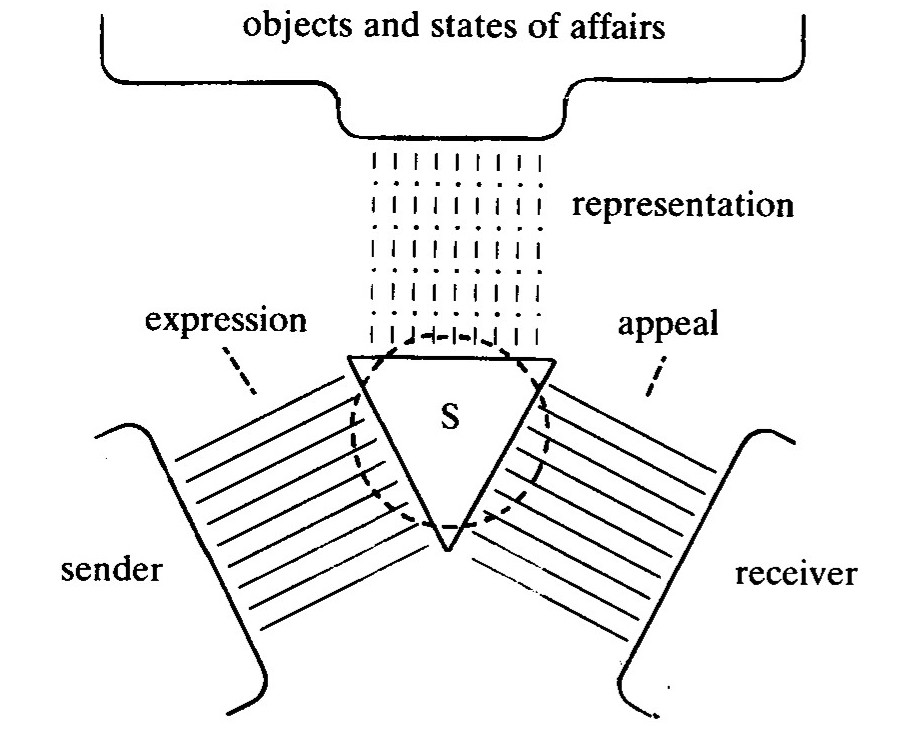

::::: {.notes}
- 10:31–10:33
:::::

## Structuralism

::::: {.columns}
:::: {.column width="60%"}
- The linguist who has, first and foremost, shaped linguistic thinking in the 20th century is **Ferdinand de Saussure (1857–1913)**. 
- We know about his theory of language from a set of lecture notes from a lecture delivered at Geneva university, which were published by his students as *Cours de linguistique générale* in 1916.

(cf. @Kortmann2020Essentials, 5–9)
::::
:::: {.column width="40%"}
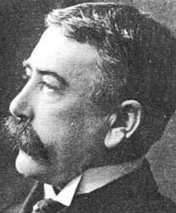
::::
:::::

:::: {.notes}
- 10:33–10:36
::::

## The model of the linguistic sign [@deSaussure1916Cours]

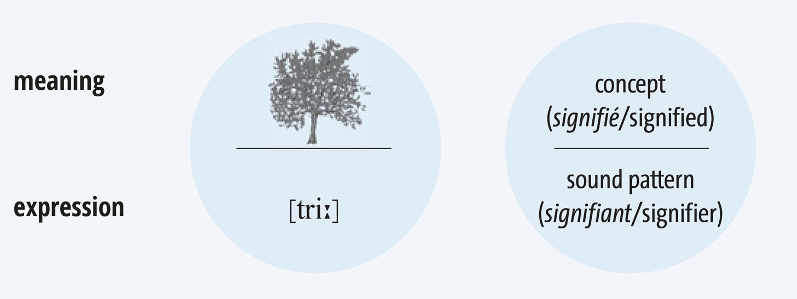

:::: {.notes}
- 10:36–10:40
::::

## De Saussure’s concept of the linguistic sign

The linguistic sign has the following set of characteristics:

:::: {.incremental}
- **Reciprocity**
  - The signifier/signifiant evokes the signified/signifié, and vice versa.
- **Arbitrariness**
  - This relationship is unmotivated. There is no obvious reason why a particular signifier should represent a certain signified.
- **Conventionality**
  - This relationship between signifier and signified is based upon an implicit ‘agreement’ between speakers of speech communities.
::::

::::: {.notes}
- 10:40–10:42
:::::

## Different types of signs: Peirce

Three major types of signs depending on the relationship between signifier and signified:

:::: {.incremental}
- **symbol**
  - arbitrariness: lack of motivated link (cf. de Saussure’s linguistic sign)
- **icon**
  - similarity: visual, acoustic, … (e.g., meow for the cat)
- **index**
  - effect–cause or contiguity (i.e., proximity in space/time) (e.g., smoke as a sign of fire)
::::

:::: {.notes}
- 10:42–10:43
::::

___

### Exercise: symbols, icons, indices

Classify each sign and state the underlying relationship (arbitrariness, similarity, contiguity).

1. traffic light colours
2. portrait photo
3. tree rings for a tree's age
4. onomatopoeia of the word *click*
5. national flag of Japan for the country
6. wet footprints on the floor

:::: {.notes}
- 10:43–10:45
::::

:::: {.content-visible when-meta="params.show_solutions"}
___

#### Solution

| Item                                      | Sign       | Relationship                         |
|-------------------------------------------|------------|--------------------------------------|
| 1. traffic light colours                  | symbol     | arbitrariness (convention)           |
| 2. portrait photo                         | icon       | similarity (visual)                  |
| 3. tree rings for a tree's age            | index      | contiguity (systematic correlation)  |
| 4. onomatopoeia of the word *click*       | icon       | similarity (acoustic)                |
| 5. national flag of Japan for the country | symbol     | arbitrariness (convention)           |
| 6. wet footprints on the floor            | index      | contiguity (proximity in space/time) |
::::

## Paradigmatic vs syntagmatic relations

Linguistic units (in phonology, word-formation, syntax etc.) stand in two types of relationships:

- Elements which co-occur in horizontal order form syntagms or "chain relationships".
- Elements which replace each other in the same functional slot form paradigms or "choice relationships".

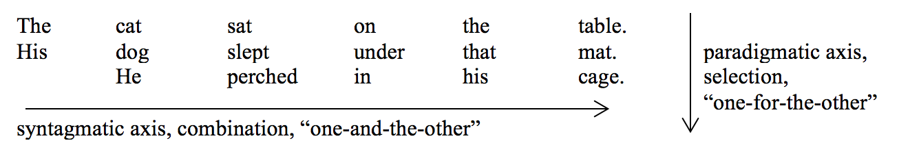

:::: {.notes}
- 10:45–10:46
::::

## Linearity of language

::::: {.columns}
:::: {.column width="60%"}
Language is linear: Saussure's signifier unfolds in time along the syntagmatic chain.

- In chat, the platform serialises turns with timestamps; order itself creates meaning.
- Simultaneous cues (emoji, read receipts, voice notes) are anchored to points on the chain; the app linearises them.
- Interpretation is path‑dependent: earlier items license later ones (anaphora, ellipsis).
- Therefore, where spoken or written, language is always linear in the end.
::::
:::: {.column width="40%"}
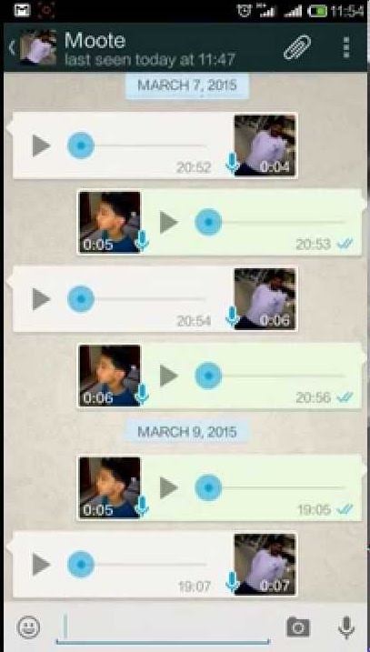{height=450}
::::
:::::

:::: {.notes}
- 10:46–10:47
::::

## Aim of structuralism and emancipation from de Saussure

**Aim of Structuralism**: Identifying and describing elements in the system (on all levels of a language: sounds, words and their components, sentences and their constituents) in terms of their paradigmatic and syntagmatic relationships to other elements in the system.

Since the 1960s …

- renewed interest in language **variation** and **change** (vs primacy of synchrony)
- research into language use by individual speakers in different social situations → **pragmatics** & **sociolinguistics** (vs primacy of the system)
- recognition of **fuzzy boundaries/continua** and acceptance of dichotomies only as pedagogically useful idealisations (e.g., synchrony – diachrony, language system – language use, vocabulary – grammar, written language – spoken language)

::::: {.notes}
- 10:47–10:50
:::::

## Synchrony vs diachrony

![Change of meaning over time [@Hamilton2016Diachronic]](img/change-of-meaning.png)

:::: {.incremental}
- **Synchrony**: 
  - study of the language system at a single time point; internal relations among elements.
- **Diachrony**: 
  - study of change over time; how forms and meanings evolve.
::::

:::: {.notes}
- 10:50–10:55
::::

## Langue and parole

:::: {layout="[60,40]"}
::::: {.incremental}
- **Langue**: 
  - rules of the game
  - abstract linguistic system shared by a speech community; grammar and lexicon independent of individual use
- **Parole**: 
  - how the game is actually played
  - concrete, individual language use in context; actual utterances with performance variation
:::::

::::

::::: {.notes}
- 10:55–10:56
:::::

## Descriptivism vs prescriptivism

:::: {layout="[60,40]"}
::::: {.incremental}
- **Descriptivism**
    - describes how speakers actually use language without judging forms as right or wrong.
    - e.g. accepting double negatives in some dialects as systematic grammar.
- **Prescriptivism**
    - sets rules for how people ought to use language, often based on tradition or style.
    - e.g. forbidding sentence‑final prepositions in formal writing.
:::::

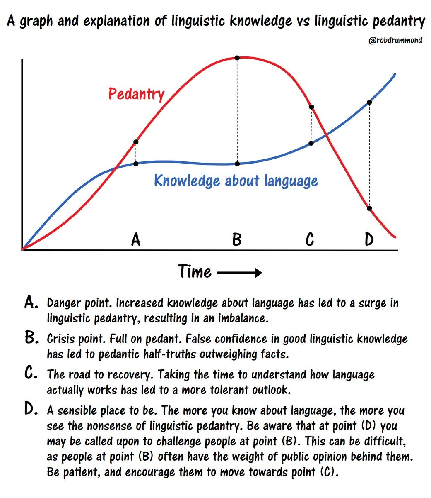
::::

:::: {.notes}
- 10:56–10:57
::::

## Object language vs metalanguage

### Definitions

- **Object language**
  - language used as the subject of description or analysis (the examples themselves).
- **Metalanguage**
  - language used to talk about language (terms, rules, and descriptions).

### Examples

1. Saying *shit* is not allowed.
2. *verb* is a noun.
3. I don't know the word for *word* in Spanish.

:::: {.notes}
- 10:57–10:58
::::

---

### Exercise

1. The meaning of bank is ambiguous.
2. Noun phrases often start with the words the or a.
3. Morphology is the field of language which studies the formation of new words.
4. The past tense of verbs is formed by adding the suffix -ed.

:::: {.notes}
- 10:58–11:00
::::

---

:::: {.content-visible when-meta="params.show_solutions"}
#### Solution

1. The meaning of *bank* is ambiguous.
2. Noun phrases often start with the words *the* or *a*.
3. Morphology is the field of language which studies the formation of new words.
4. The past tense of verbs is formed by adding the suffix *-ed*.
::::

## Recap — Fundamentals

1. What are the key characteristics of the linguistic sign according to de Saussure?
2. What is the difference between syntagmatic and paradigmatic relations?
3. What is the difference between synchrony and diachrony?

:::: {.notes}
- 11:00–11:02
::::

## Quiz

:::: {.incremental}
1. What does “arbitrary” mean in Saussure’s sign?  
   a) random noise; 
   b) no natural link between form and meaning; 
   c) unpredictable usage
2. Which substitution best illustrates a paradigmatic relation?  
   a) Replacing *student* with *teacher* in "The ___ reads the book"  
   b) Adding *quickly* after *reads*  
   c) Moving *the* to the end of the sentence
3. Which of the following is an index?  
   a) The word *tree*  
   b) A photograph of a cat  
   c) Smoke signalling fire
::::

:::: {.notes}
- 11:02–11:04
::::

# Linguistic domains

## Overview

- language as **structure**: phonetics, phonology, morphology, semantics, syntax, text linguistics

- language as a **cultural and social phenomenon**: contact linguistics, historical linguistics, dialectology, pragmatics, sociolinguistics

- language as a **biological phenomenon**: neurolinguistics, psycholinguistics, cognitive linguistics

- practical **applications**: second language acquisition/teaching, compiling dictionaries, translation theory, computer linguistics, artificial intelligence research, forensic linguistics

- …

:::: {.notes}
- 11:04–11:06
::::

## Core domains

- phonetics and phonology
- morphology and word-formation
- syntax
- semantics
- pragmatics
- sociolinguistics
- historical linguistics
- …

:::: {.notes}
- 11:06–11:07
::::

## Phonetics and phonology

***Our Strange Lingo* (Lord Cromer)**

When the English tongue we speak.  
Why is break not rhymed with freak?  
Will you tell me why it's true  
We say sew but likewise few?  
And the maker of the verse,  
Cannot rhyme his horse with worse?  
Beard is not the same as heard  
Cord is different from word.  
Cow is cow but low is low  
Shoe is never rhymed with foe.  

___

Think of hose, dose, and lose  
And think of goose and yet with choose  
Think of comb, tomb and bomb,  
Doll and roll or home and some.  
Since pay is rhymed with say  
Why not paid with said I pray?  
Think of blood, food and good.  
Mould is not pronounced like could.  
Wherefore done, but gone and lone -  
Is there any reason known?  
To sum up all, it seems to me  
Sound and letters don't agree.

:::: {.notes}
- 11:06–11:09
::::

## Phonetics and phonology

What do you hear?

::::: {.columns}
:::: {.column width="50%"}
Test

<!--  -->

::::
:::: {.column width="50%"}
Analysis


::::
:::::

:::: {.notes}
- 11:09–11:12
::::

## Morphology and word-formation

### Analysing complex words

1. How many parts does the word *disclaimers* consist of?
2. How can we analyse this complex word in terms of its parts?

___

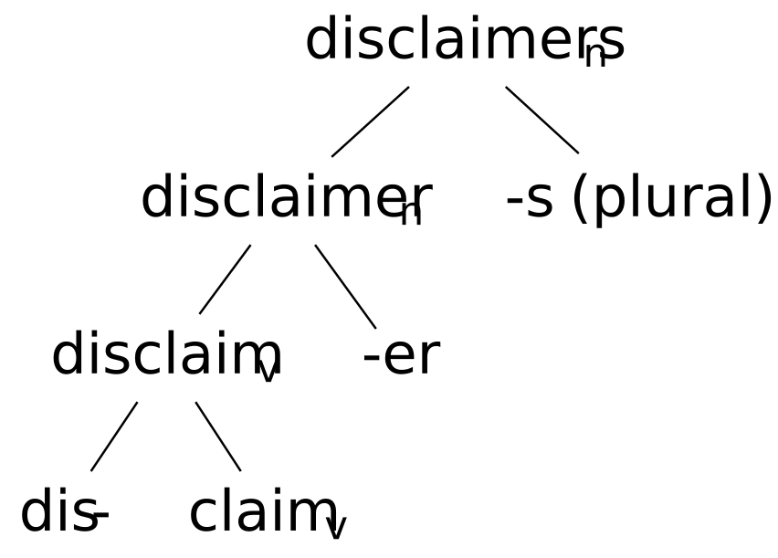

::::: {.notes}
- 11:12–11:14
:::::

---

### Why and how do we form new words?

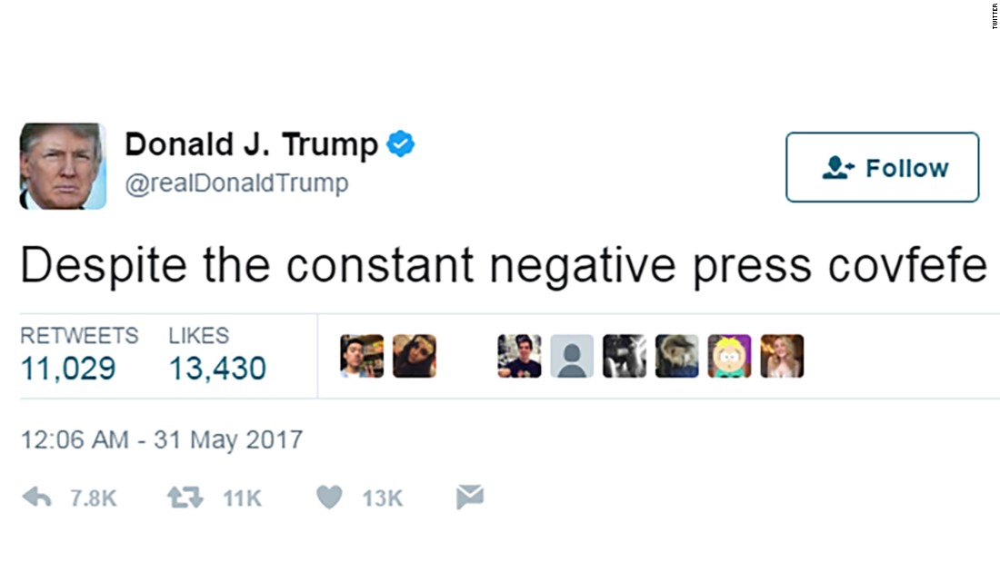

:::: {.notes}
- 11:15–11:18
::::

## Syntax

What's the problem with the following sentence?

*The old man the boat.*

___

**The sentence is ungrammatical:**

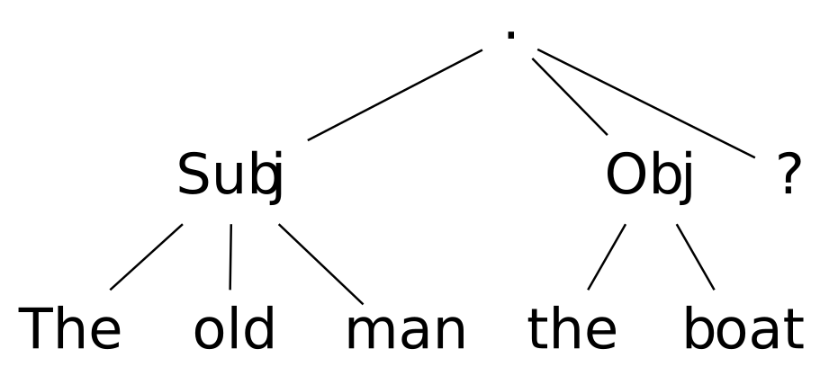

___

**The sentence is grammatical:**

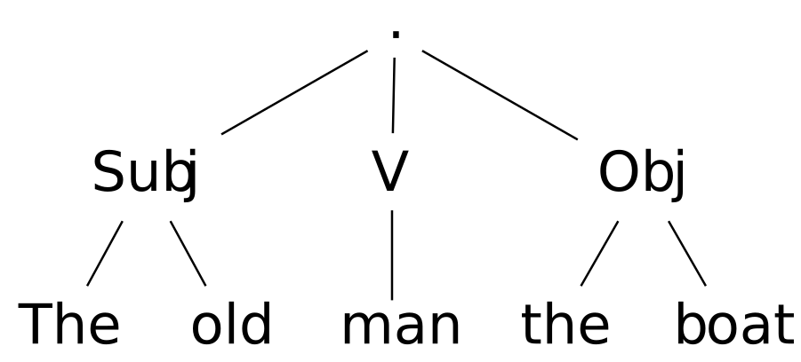

:::: {.notes}
- 11:18–11:22
::::

## Applied fields

### Overview

- lexicography
- language acquisition and learning (teaching)
- cognitive linguistics and psycholinguistics
- computational linguistics
- forensic linguistics
- …

:::: {.notes}
- 11:22–11:24
::::

---

### Lexicography

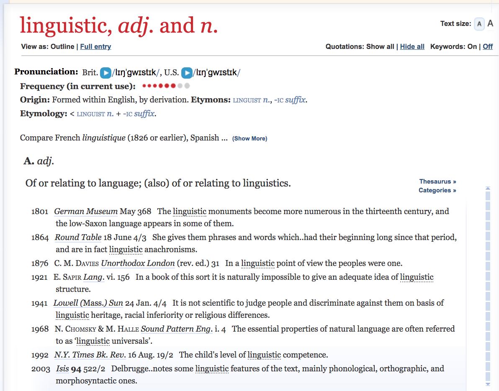

::::: {.notes}
- 11:24–11:25
:::::

---

### Cognitive linguistics and psycholinguistics

#### The Stroop test foo

:::: {layout="[50, 50]"}
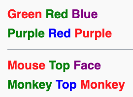{width=500}


::::

:::: {.notes}
- 11:25–11:27
::::

---

### Computational linguistics

![Hubs of lexical innovation [@Grieve2018MappingLexical]](img/lexical-innovation.png)

:::: {.notes}
- 11:27–11:30
::::

# Summary and outlook

## Key points

- Structuralism foregrounds synchrony and the linguistic system.
- Linguistic signs are reciprocal, arbitrary, and conventional.
- Relations: syntagmatic (chain) vs paradigmatic (choice).
- Peirce’s triad: symbol (arbitrariness), icon (similarity), index (contiguity).
- Linguistics spans core domains and applied fields; methods and examples matter.

:::: {.notes}
- 11:40–11:42
::::

## Next week: Pragmatics

Read @Kortmann2020Essentials: ch. 7

:::: {.notes}
- 11:42–11:45
::::

# References

::: {#refs}
:::

