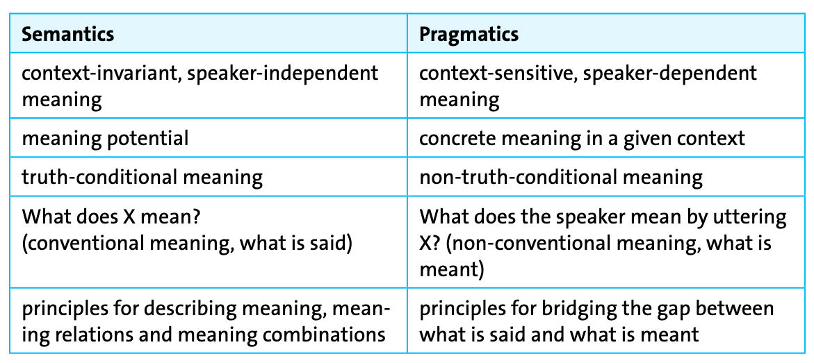
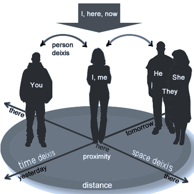
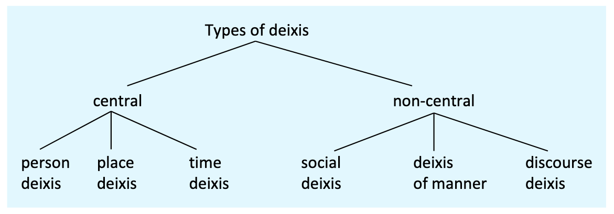
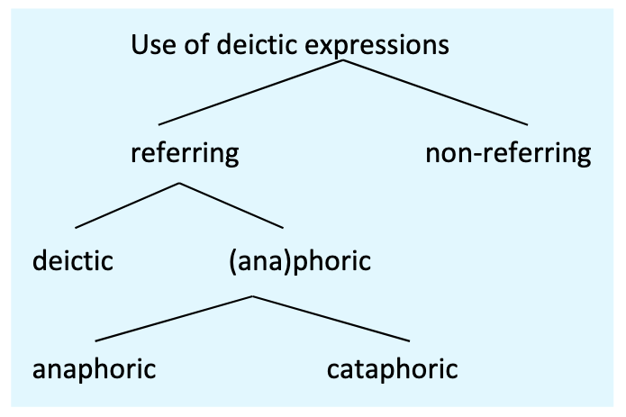
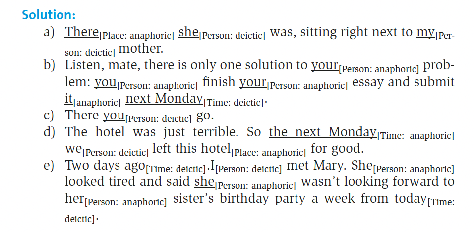
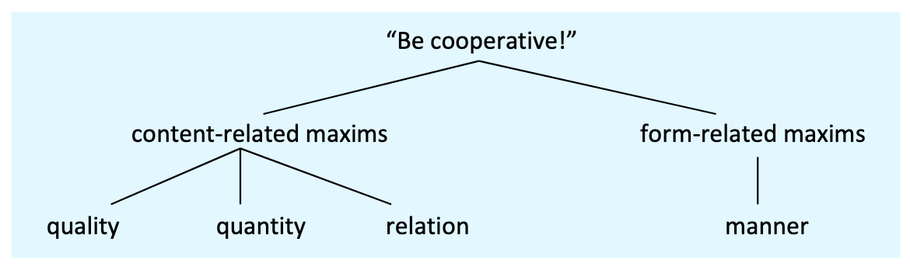

::: {.content-hidden when-format="revealjs"}
[Open slides version](slides.html){.btn .btn-primary}
:::

# Outline

1. [Organisation](#organisation): How does this course work?
2. [Introduction to pragmatics](#object-of-study): How does context shape what we mean?
3. [Deixis](#deixis): Why do words like *here*, *now*, and *you* shift meaning?
4. [Speech act theory](#speech-acts): How do we do things with words?
5. [Indirect speech acts](#indirect-speech-acts): Why don't we always say what we mean directly?
6. [Cooperative principle and conversational maxims](#conversational-implicatures): What makes conversation work?

## Learning outcomes

You should be able to ...

- understand how pragmatics differs from semantics and why context matters
- identify deictic expressions and classify their dimensions
- identify and classify speech acts (levels and Searle’s types)
- recognise direct vs indirect speech acts and degrees of indirectness
- apply Grice’s cooperative principle and maxims to analyse implicatures

# Organisation

## Tutorials {.small}



# Object of study {.small}

## Example

*There's a policeman in the corner.*

## What is pragmatics? {.small}

@Kortmann2020Essentials: 173–174

> In semiotics, pragmatics is traditionally defined as a subdiscipline which is concerned with **the relationship between signs and their users**. The roots of pragmatics as the study of language use or linguistic performance lie in this (primarily) European tradition of research in semiotics. 

. . .

> The pragmatic approach is usually contrasted with the **structuralist approach**, which is solely concerned with **language systems in a vacuum** (i. e. with the **langue** or the linguistic competence of a member of a certain speech community), independent of concrete communicative situations.

. . .

> Most linguists working in an Anglo-American tradition have adopted a narrower definition, according to which pragmatics represents a linguistic subdiscipline that **complements semantics**. This line of research focuses on concepts such as **utterance meaning**, **intention** and **inference**. Communication is primarily seen as the negotiation of meaning between interlocutors (or between authors and readers).

## Semantics vs pragmatics

## Example: Polysemy and context

Consider the word *chair*:

1. a piece of furniture for one person to sit on
2. the person in charge of a meeting or organisation
3. a university professorship

. . . 

- **Semantics** describes the different meanings (polysemy).
- **Pragmatics** explains how we determine which meaning is intended in a given context.

# Deixis

## Example

> Meet me here same time tomorrow with a book about this size.

## Deictic centre

::: {layout="[60,40]"}
- “The speaker and certain features of the **utterance context** (primarily time and place) represent the central **point of reference** (origo or deictic centre) for context-dependent meaning. 
- The deictic centre naturally **shifts** as soon as another speaker starts talking, but it can also be deliberately projected onto the hearer/reader, resulting among other things in a shift in the time and place coordinates.” [@Kortmann2020Essentials: 176]

:::

## Deictic dimensions

## Use of deictic expressions

**Examples:**

- **Anaphoric:** *John came in. **He** sat down.* (*He* refers back to *John*)
- **Cataphoric:** ***He** was tired, but John kept working.* (*He* refers forward to *John*)

## Shift of deictic centre

The deictic centre can shift, e.g. to hearer/reader and their coordinates:

- *When you read these lines today, I'll be no longer in the country.*

**Deictic centre is shifted in reported speech:**

- Direct speech: *I won't be here tomorrow.* 
- Reported speech: *He said he wouldn't be there the following day.*

| Direct      | Reported         | Type    |
|-------------|------------------|---------|
| *I*         | *he*             | person  |
| *here*      | *there*          | spatial |
| *tomorrow*  | *following day*  | temporal|

## Exercise (1)

Identify the deictic expressions in the following examples and specify which type of deixis they are:

a) There she was, sitting right next to my mother.
b) Listen, mate, there is only one solution to your problem: you finish your essay and submit it next Monday.
c) There you go.
d) The hotel was just terrible. So the next Monday we left this hotel for good.
e) Two days ago I met Mary. She looked tired and said she wasn't looking forward to her sister's birthday party a week from today.

---

:::: {.content-visible when-meta="params.show_solutions"}

::::

## Exercise (2) 

Identify all deictic expressions and classify them by dimension:

a) *I'll see you here tomorrow.*
b) *She told me that she would come the next day.*
c) *Now listen, Sir, this is the last time I'm going to say this.*
d) *In the last chapter we discussed phonology.*

---

### Solution

::: {.content-visible when-meta="params.show_solutions"}
**Solutions:**

a) *I* (personal), *you* (personal), *here* (spatial), *tomorrow* (temporal)
b) *me* (personal), *she* (personal), *the next day* (temporal, shifted centre)
c) *Now* (temporal), *Sir* (social), *this* (manner/degree, x2), *I* (personal)
d) *the last chapter* (discourse/text), *we* (personal)
:::

## Exercise (3)

Classify the deictic expressions in the following sentences:

1. *I'll be there in five minutes.*
2. *Thank you, Professor, for your comments earlier today.*
3. *As mentioned above, these results are significant.*
4. *This solution is better than that one.*

---

### Solution

:::: {.content-visible when-meta="params.show_solutions"}
1. *I* (personal), *there* (spatial), *in five minutes* (temporal)
2. *you* (personal), *Professor* (social), *your* (personal), *earlier today* (temporal)
3. *above* (discourse), *these results* (may involve discourse deixis in context)
4. *This* (manner/degree), *that* (manner/degree)
::::

## Recap — Deixis

- deixis anchors expressions to participants, place, time, text and social roles
- the deictic centre (origo) can shift across reporting and addressees

# Speech acts 

## What are speech acts?

> The basic unit of verbal interaction is defined as a speech act. A speech act is an utterance made by a certain speaker/author to a hearer/reader in a certain context. It is not their structural (phonological/ syntactic) or semantic properties (proposition) which are crucial to speech acts, nor their possible effect on the addressee (perlocution). [@Kortmann2020Essentials: 180]

. . .

> Illocution: The most important aspect of speech acts is rather the speaker’s/author’s communicative intention (the illocution). [@Kortmann2020Essentials: 180]

## Speech act theory

'How to do things with words'

- A speech act is the basic unit of verbal interaction; an utterance made by a certain speaker/author to a hearer/reader in a certain context.

- Speech act theory was developed by @Austin1975How and @Searle1969Speech.

. . .

> Speech act theory […] proceeds from the observation that everyday communication is more than just an exchange of statements about the world which are assessed in terms of truth or falsity. For one reason, there are many utterances which are not used for describing some state of affairs […]; for another, truth conditions are often not very useful if we want to understand the speaker's intention, i.e. what is really meant by an utterance. 

## Components of speech acts {.small}

**Example utterance:** *It's hot in here!*

- **Locution** 
  - 'saying' 
  - Utterance act; **structural and semantic properties** → formulating and pronouncing a grammatical and meaningful utterance 
  - 'room is hot'
- **Illocution** 
  - 'in saying' 
  - Communicative **intention** of the speaker (promise, command, apology etc.) 
  - Request to open window
- **Perlocution** 
  - 'by saying' 
  - **Effect** produced on the listener 
  - Addressee feels obliged to open window

## Types of speech acts {.smaller}

@Kortmann2020Essentials: 181

- **Assertives** or **representatives** 
  - are used to describe the world 
  - (e. g. *state*, *express*, *claim*, *tell*, *describe*, *assert*, *admit* something). 
- **Directives** 
  - are attempts to get people to do things, to change the world in the way specified by the speaker 
  -(e. g. give an order, ask something or ask somebody to do something). 
- By means of **commissives** 
  - speakers commit themselves to a future action which will change the world in some way 
  -(e. g. by promising, threatening or committing oneself to something). 
- **Expressives** 
  - are used to express our feelings and opinions; expressives offer a glimpse of the hearer’s psychological state 
  -(e. g. *thank*, *greet*, *congratulate*, *apologize*, *complain*).
- **Declarations** 
  - essentially serve to bring about a new external situation; they show that the world can indeed be changed by language 
  - (e. g. *baptisms*, *marriages*, *divorces*, *declarations of war*). This type of speech acts is clearly different from the other four types in that it requires specific extra-linguistic institutions or legal settings.

## Illocutionary devices

How do speakers signal their illocutionary intent?

| Device               | Example                                   |
|----------------------|-------------------------------------------|
| **Performative verb**| *I hereby promise that I will come.*      |
| **Word order**       | *Will you come?* (interrogative)          |
| **Stress/intonation**| *YOU did this?* vs *You did THIS?*        |
| **Adverbs**          | *Frankly, I don't care.*                  |
| **Particles**        | *Oh, you're here.* vs *Ah, you're here.*  |

## Exercise: Classifying illocutionary acts {.smaller}

Which type of illocutionary act is expressed in the following utterances?

1. I hereby christen you Marie Claire.
2. I apologise for this awful mess.
3. You are under arrest.
4. Shall I get you some water?
5. I claim that this theory needs revision.
6. Congratulations on your appointment.
7. Our team has won the competition.
8. I'm sorry that I could not come to your birthday party!
9. Thank you for taking care of my daughter.
10. Good job, Claire!
11. You are fired.
12. Be quiet, Jaye.
13. I name this ship 'Fortune'.
14. One more step, and I'll call the police.
15. Come to visit us tomorrow.
16. I am sorry that I could not come to your birthday party!
17. I'll bring you a map of London.
18. I hereby pronounce you husband and wife.
19. I refuse to answer this question.
20. Could you please show me the way?

---

### Solutions

::: {.content-visible when-meta="params.show_solutions"}
:::: {.smaller}
1. *I hereby christen you Marie Claire.*: **Declarative**
2. *I apologise for this awful mess.*: **Expressive**
3. *You are under arrest.*: **Declarative**
4. *Shall I get you some water?*: **Directive**
5. *I claim that this theory needs revision.*: **Assertive**
6. *Congratulations on your appointment.*: **Expressive**
7. *Our team has won the competition.*: **Assertive**
8. *I'm sorry that I could not come to your birthday party!*: **Expressive**
9. *Thank you for taking care of my daughter.*: **Expressive**
10. *Good job, Claire!*: **Expressive**
11. *You are fired.*: **Declarative**
12. *Be quiet, Jaye.*: **Directive**
13. *I name this ship 'Fortune'.*: **Declarative**
14. *One more step, and I'll call the police.*: **Directive**
15. *Come to visit us tomorrow.*: **Directive**
16. *I am sorry that I could not come to your birthday party!*: **Expressive**
17. *I'll bring you a map of London.*: **Commissive**
18. *I hereby pronounce you husband and wife.*: **Declarative**
19. *I refuse to answer this question.*: **Commissive**
20. *Could you please show me the way?*: **Directive**
::::
:::

## Indirect speech acts

@Kortmann2020Essentials: 183

- “In indirect speech acts, speakers perform a speech act (the primary speech act) via another (secondary) speech act. 
- In some cases, then, two speech acts are realized at once, one of them being explicit, the other implicit. 
- As far as the speaker’s communicative intention is concerned, the implicit speech act is the more important one.” 

### Examples

- *It's really cold in here.*
- *Can you pass me the salt?*
- *Do you know what time it is?*

---

### Degrees of indirectness → directness

| Directness | Example                                      |
|:----------:|:---------------------------------------------|
| ↓          | *It's a bit cold in here, isn't it?*         |
| ↓          | *The window seems to be open.*               |
| ↓          | *Would you mind closing the window?*         |
| ↓          | *Would you please shut the door?*            |
| ↓          | *Shut the door!*                             |
| ↓          | *Shut the f\*\*\*ing door!*                  |

---

### Direct vs indirect: Analysis

::: {.small}
How do hearers infer indirect illocutionary acts? 

**Example:** *Can you pass the salt?*

:::: {.fragment}
1. I have asked X whether he has the ability to pass the salt (fact)
2. I have no reason to think he cannot pass the salt (assumption of hearer's ability)
3. He knows that I know this (mutual knowledge)
4. I would not ask a question to which the answer is obvious (cooperative principle)
5. Therefore, I must mean something more
6. The context is a meal where salt-passing is appropriate
7. He knows that I know the context
8. Therefore, he knows my question is not really a yes/no question
9. Therefore, I must be asking him to do something
10. The obvious request in this context is: pass me the salt
::::

:::: {.fragment}
- **Direct**, **secondary** illocution: *Are you able to pass the salt?* 
- **Indirect**, **primary** illocution: *Pass me the salt!* 
::::
:::

# Conversational implicatures

## The cooperative principle

The Cooperative Principle, introduced by @Grice1975LogicConversation, assumes that communicating is cooperative behaviour: "...every communicative event proceeds on the assumption that speaker and hearer (or author and reader) want to cooperate – even if at first sight this might not seem to be the case." [@Kortmann2020Essentials: 184]

## Maxims

::: {.small}
@Kortmann2020Essentials: 185

- “**Quality**: Make your contribution one that is true. 
  - Do not say what you believe to be false (Quality^1^). 
  - Do not say that for which you lack adequate evidence (Quality^2^). 
- **Quantity**: 
  - Make your contribution as informative as is required for the current purposes of the exchange (Quantity^1^) 
  - and not more informative than required (Quantity^2^). 
- **Relation**: Be relevant. Do not change the topic. 
- **Manner**: Be perspicuous: 
  - Avoid obscurity of expression (Manner^1^), 
  - avoid ambiguity (Manner^2^), 
  - be brief (Manner^3^) 
  - and orderly (Manner^4^).” 
:::

## Real-world example: Maxim violations

Consider political debates where candidates violate maxims strategically:

**Question to candidate:** *Will you raise taxes?*

**Possible responses violating maxims:**

- **Quantity:** Giving far more information than requested to avoid direct answer
- **Relation:** Changing the topic: 'What really matters is job creation…'
- **Manner:** Using deliberately obscure language: 'We will pursue revenue-optimisation strategies…'
- **Quality:** Simply lying (saying what one believes to be false)

Hearers recognise these violations but candidates bet on evading accountability.

## Exercise: Identifying maxim violations

For each conversation below, identify which maxim(s) is/are being violated and explain what conversational implicature is likely intended.

**Example:**
- A: *How was the movie?*
- B: *Well, the popcorn was delicious.*

**Answer:** Violates **Relation** (relevance). Implicature: The movie was terrible.

---

### Exercise items 

::: {.small}
1. **A:** *Did you finish your homework?*  
   **B:** *I started it at 3pm, then I had a snack, then I watched some TV, then I went back to it, then I had dinner, then I worked on it some more...*

2. **A:** *What time is it?*  
   **B:** *Yes.*

3. **A:** *How was your date last night?*  
   **B:** *The restaurant had excellent lighting.*

4. **A:** *Can you help me move this weekend?*  
   **B:** *I have a very important appointment with my dentist's receptionist's cousin's dog walker.*

5. **A:** *Do you know where Sarah is?*  
   **B:** *She's either in the library, at home, at the gym, or somewhere else.*

6. **A:** *What did you think of the presentation?*  
   **B:** *It was... interesting.*

7. **A:** *Will you be at the meeting tomorrow?*  
   **B:** *I might be there, or I might not be there, depending on various factors that may or may not occur.*

8. **A:** *How much does this cost?*  
   **B:** *It's not free.*
:::

---

### Solutions

::: {.content-visible when-meta="params.show_solutions"}
1. **Quantity** (too much information). Implicature: I didn't finish it.
2. **Relation** (irrelevant answer). Implicature: I don't know what time it is.
3. **Relation** (changing topic). Implicature: The date was terrible.
4. **Manner** (obscure/unclear). Implicature: No, I can't help you.
5. **Quantity** (unnecessarily vague). Implicature: I don't know where Sarah is.
6. **Manner** (ambiguous/unclear). Implicature: The presentation was bad.
7. **Manner** (unnecessarily verbose). Implicature: Probably not.
8. **Quantity** (not informative enough). Implicature: I don't want to tell you the price.
:::

## Summary

- the cooperative principle guides interpretation towards relevance and sufficiency
- maxims (quality, quantity, relation, manner) explain implicature triggers
- flouting prompts re-interpretation rather than literal rejection

# Summary and outlook

## Summary

- pragmatics explains how we infer speaker meaning beyond literal content
- deixis and deictic centre anchor meaning to context and can shift
- speech acts structure illocutionary force
- indirect speech acts are inferred via context and cooperation

## Next week: Phonetics & Phonology I

Read @Kortmann2020Essentials: ch. 2.1.

# References

:::: {#refs}
::::
