::: {.content-hidden when-format="revealjs"}
[Open slides version](slides.html){.btn .btn-primary}
:::

# Outline

1. [Phonetics vs phonology](#phonetics-vs-phonology): What's the difference between sounds we make and sound systems?
2. [Speech organs](#speech-organs): Which body parts do we use to produce speech?
3. [Consonants](#consonants): How do we classify consonant sounds?
4. [Vowels](#vowels): How do we describe and map vowel sounds?
5. [Transcription](#transcription): How can we write down pronunciation?


# Phonetics vs phonology {#phonetics-vs-phonology}

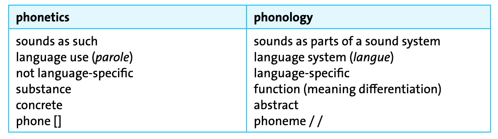


## Exercise

Assign the following items to the correct linguistic concepts:

:::: {.columns}
::: {.column width="50%"}
- langue
- slashes for transcription /…/
- not language-specific
- concrete realisation
:::
::: {.column width="50%"}
- abstract entity
- parole
- square brackets for transcription […]
- language-specific
:::
::::

### Concepts

::: {layout="[50,50]"}
1.\ **phoneme**

2.\ **phone**
:::


::: {.excl .slide}
:::: {.columns}
::::: {.column width="50%"}
**Phoneme:**

- langue
- language-specific
- slashes for transcription /.../
- abstract entity
:::::
::::: {.column width="50%"}
**Phone:**

- concrete realisation
- not language-specific
- square brackets for transcription [...]
- parole
:::::
::::
:::


## Broad vs narrow transcription

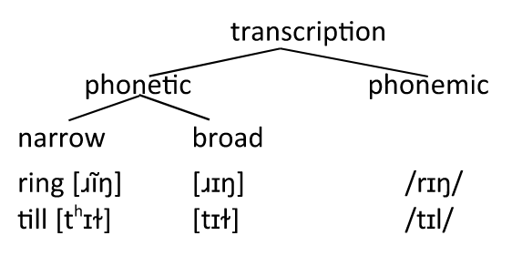


# Speech organs

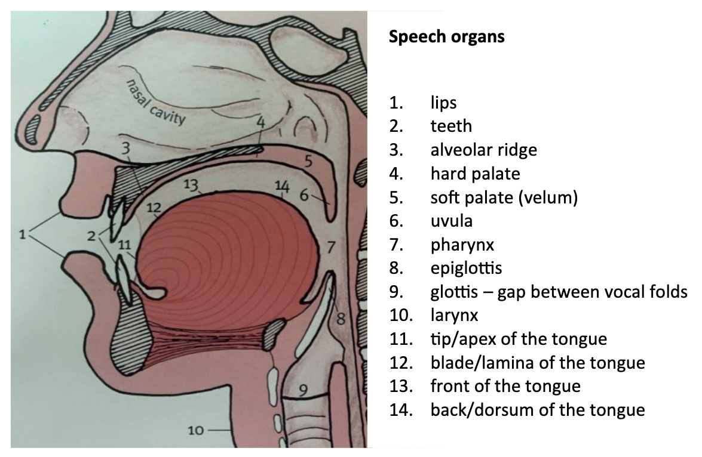


## Exercise: name vocal organs and describe speech sounds

::: {layout="[50,50]"}
1. Fill in the blanks in this figure with the correct names of the vocal organs.
2. Give the respective adjectives used to describe speech sounds produced at this place.

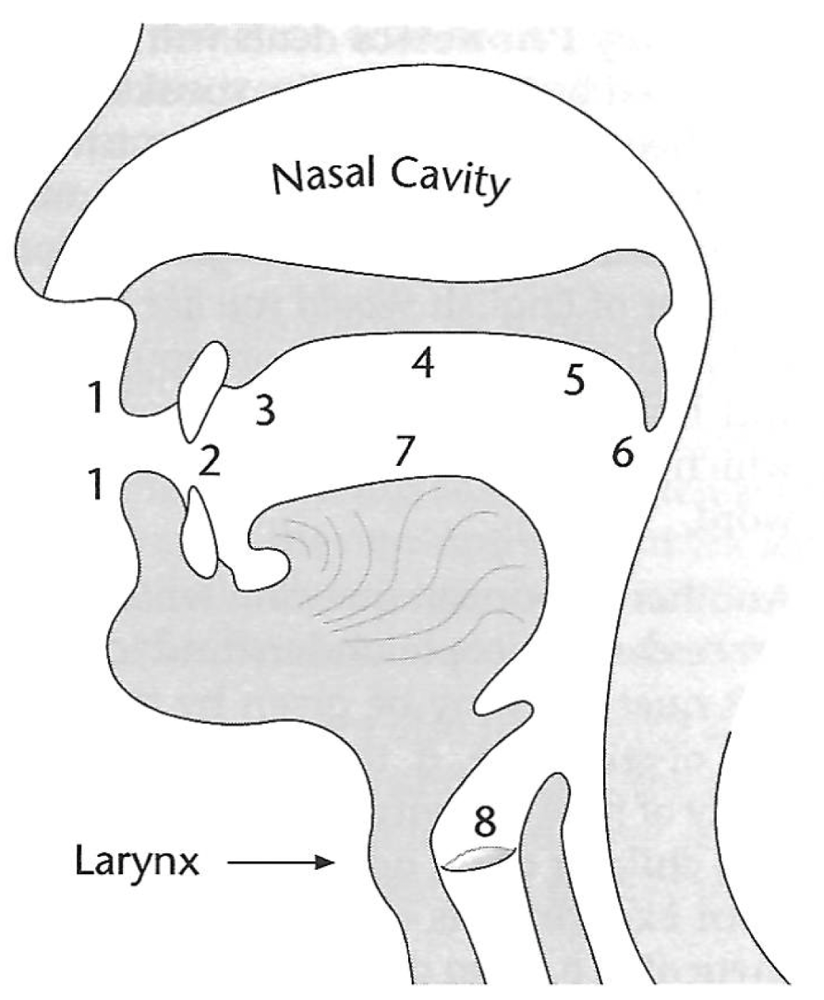
:::

::: {.excl .slide}
| No. | Organ                         | Adjective         |
|:---:|-------------------------------|-------------------|
| 1   | lips                          | labial            |
| 2   | teeth                         | dental            |
| 3   | alveolar ridge                | alveolar          |
| 4   | hard palate                   | palatal           |
| 5   | soft palate (velum)           | velar             |
| 6   | uvula                         | uvular            |
| 7   | tongue                        | dorsal            |
| 8   | glottis                       | glottal           |
:::


## Place of articulation

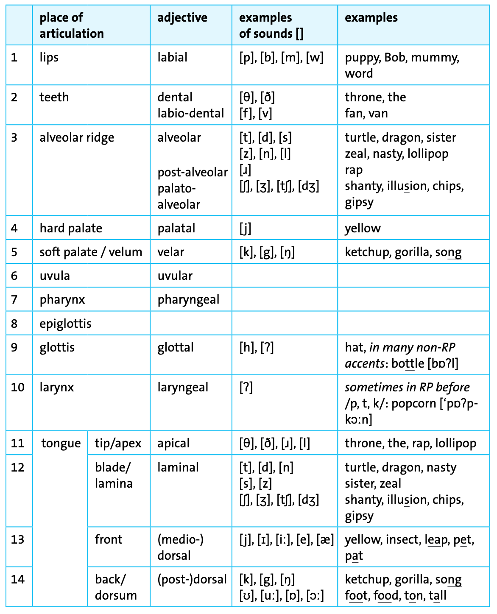


# Consonants

## Consonant inventory

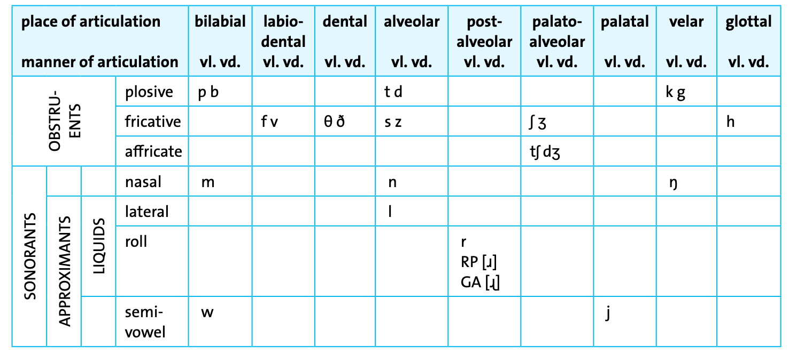


## Voiced vs unvoiced

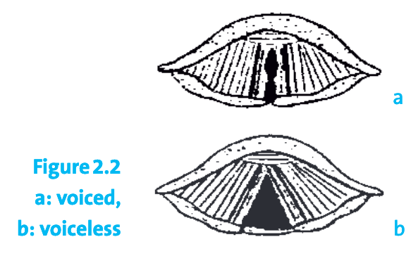


## Exercise: identify consonant types

Identify the IPA symbols below which represent

a. plosives
b. fricatives
c. voiced consonants.

::: {layout="[30, 30, 30]"}
1.\ [b]\
2.\ [s]\
3.\ [ʊ]\
4.\ [w]\

5.\ [ʃ]\
6.\ [x]\
7.\ [k]\
8.\ [l]\

9.\ [ɪ]\
10.\ [θ]\
11.\ [ŋ]\
12.\ [d]\
:::

::: {.excl .slide}
:::: {.columns}
:::: {.column width="25%"}
**a. Plosives**

1.\ [b]\
7.\ [k]\
12.\ [d]
::::
:::: {.column width="25%"}
**b. Fricatives**

2.\ [s]\
5.\ [ʃ]\
6.\ [x]\
10.\ [θ]
::::
:::: {.column width="25%"}
**c. Voiced consonants**

1.\ [b]\
4.\ [w]\
8.\ [l]\
11.\ [ŋ]\
12.\ [d]
::::
:::: {.column width="25%"}
**Other**

3.\ [ʊ] (vowel)\
9.\ [ɪ] (vowel)
::::
::::
:::


## Exercise: consonant inventory (Interactive)

```{=html}
<div style="width:100%;display:flex;flex-direction:column;gap:8px;min-height:635px;">
<iframe src="https://wayground.com/embed/quiz/6907d9dd6a315c72c89fd43f" title="Consonant Inventory - Wayground" style="flex:1;" frameBorder="0" allowfullscreen></iframe>
</div>
```

---

## Exercise: consonant inventory (Reference)

Which of these …

1. starts with an approximant: *you* or *do*?
2. ends with a fricative consonant: *race* or *real*?
3. medial consonant is voiced: *massive* or *leisure*?
4. starts with a dental consonant: *shy* or *thigh*?
5. starts with a bilabial consonant: *set* or *bet*?
6. ends with a stop consonant: *lip* or *pill*?
7. ends with a nasal consonant: *dumb* or *dull*?
8. starts with an alveolar consonant: *quip* or *dip*?
9. medial consonant is voiced: *robber* or *hopper*?
10. starts with a velar consonant: *lot* or *cot*?
11. starts with a labiodental consonant: *mat* or *vat*?

:::: {.excl .slide}
|  Word     |   IPA   |    Type      |
|:----------|:--------|:-------------|
| *you*     |  /j/    | approximant  |
| *race*    |  /s/    | fricative    |
| *leisure* |  /ʒ/    | voiced       |
| *thigh*   |  /θ/    | dental       |
| *bet*     |  /b/    | bilabial     |
| *lip*     |  /p/    | stop         |
| *dumb*    |  /m/    | nasal        |
| *dip*     |  /d/    | alveolar     |
| *robber*  |  /b/    | voiced       |
| *cot*     |  /k/    | velar        |
| *vat*     |  /v/    | labiodental  |
::::


## Exercise: determine consonant features

Determine the medial consonant phone(s) in each of the following words in terms of 

a. place of articulation
b. manner of articulation
c. voicing

::: {layout="[30, 30, 30]"}
1.\ *etching*\
2.\ *father*\
3.\ *dagger*\

4.\ *lodger*\
5.\ *sunny*\
6.\ *hopper*\

7.\ *pleasure*\
8.\ *selling*\
9.\ *singer*\
:::

::: {.excl .slide}
| Word       | Symbol(s) | Place            | Manner     | Voicing   |
|------------|-----------|------------------|------------|-----------|
| *etching*  | tʃ        | palato-alveolar  | affricate  | voiceless |
| *father*   | ð         | dental           | fricative  | voiced    |
| *dagger*   | g         | velar            | plosive    | voiced    |
| *lodger*   | dʒ        | palato-alveolar  | affricate  | voiced    |
| *sunny*    | n         | alveolar         | nasal      | voiced    |
| *hopper*   | p         | bilabial         | plosive    | voiceless |
| *pleasure* | ʒ         | palato-alveolar  | fricative  | voiced    |
| *selling*  | l         | alveolar         | lateral    | voiced    |
| *singer*   | ŋ         | velar            | nasal      | voiced    |
:::


# Vowels

## Vowel chart: features

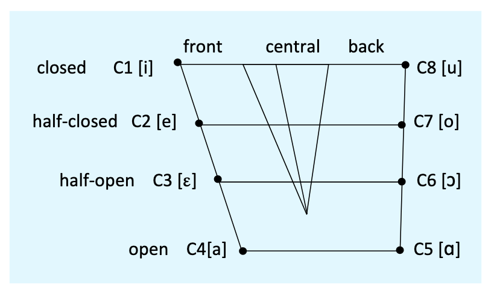


## Vowel chart: English vowels & examples

::: {layout="[50,50]"}
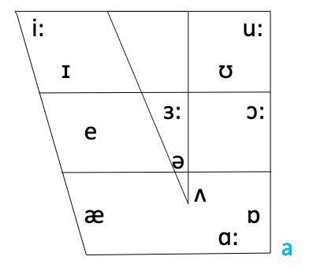

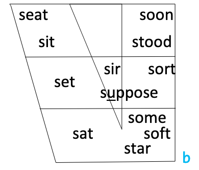
:::


## Vowel differences between British and American English

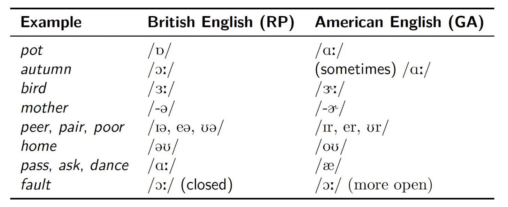


## Diphthongs

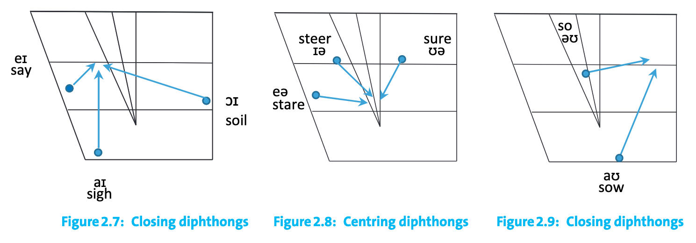


## Types of vowels

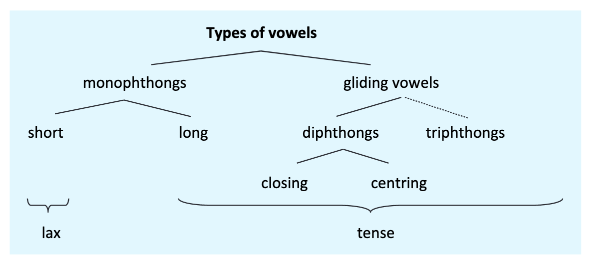


## Exercise: identify vowel sounds

In the following sets of words, the sound of the vowel is the same in every case but one. Which of these words has a different vowel sound?

1. *sane*, *paid*, *eight*, *lace*, *mast*: [*mast*: /æ/ instead of /eɪ/]{.excl .fragment}
2. *hoot*, *good*, *moon*, *grew*, *suit*: [*good*: /ʊ/ instead of /uː/]{.excl .fragment}
3. *meat*, *steak*, *weak*, *theme*, *green*: [*steak*: /eɪ/ instead of /iː/]{.excl .fragment}
4. *dud*, *died*, *mine*, *eye*, *guy*: [*dud*: /ʌ/ instead of /aɪ/]{.excl .fragment}
5. *pen*, *said*, *death*, *mess*, *mean*: [*mean*: /iː/ instead of /ɛ/]{.excl .fragment}
6. *ton*, *toast*, *both*, *note*, *toes*: [*ton*: /ɒ/ instead of /əʊ/]{.excl .fragment}


## Exercise: determine number of phonemes

How many phonemes are there in each of the following words?

| Word       | RP                          | GA                               | Phonemes            |
|:-----------|:----------------------------|:---------------------------------|:-------------------:|
| *physics*  | [/ˈfɪzɪks/]{.excl .fragment} | [←]{.excl .fragment}              | [6]{.excl .fragment} |
| *axis*     | [/ˈæksɪs/]{.excl .fragment}  | [←]{.excl .fragment}              | [5]{.excl .fragment} |
| *laugh*    | [/lɑːf/]{.excl .fragment}    | [/læf/]{.excl .fragment}          | [3]{.excl .fragment} |
| *fishes*   | [/ˈfiʃɪz/]{.excl .fragment}  | [←]{.excl .fragment}              | [5]{.excl .fragment} |
| *begged*   | [/begd/]{.excl .fragment}    | [←]{.excl .fragment}              | [4]{.excl .fragment} |
| *caught*   | [/kɔːt/]{.excl .fragment}    | [/kɑːt/, /kɔːt/]{.excl .fragment} | [3]{.excl .fragment} |
| *batting*  | [/ˈbætɪŋ/]{.excl .fragment}  | [←]{.excl .fragment}              | [5]{.excl .fragment} |
| *knock*    | [/nɒk/]{.excl .fragment}     | [/nɑːk/]{.excl .fragment}         | [3]{.excl .fragment} |
| *quick*    | [/kwɪk/]{.excl .fragment}    | [←]{.excl .fragment}              | [4]{.excl .fragment} |


# Transcription

## Transcription dictionaries

Jones, Daniel. 2011. Cambridge English pronouncing dictionary. Ed. By Peter Roach. 18th ed. Cambridge: Cambridge University Press.

<https://dictionary.cambridge.org/>

Alternative: Wells, John C. 2010. Longman pronunciation dictionary. 3rd ed. Harlow: Pearson Longman.


## Exercise: evaluate transcriptions 

### Interactive version

```{=html}
<div style="width:100%;display:flex;flex-direction:column;gap:8px;min-height:635px;">
<iframe src="https://wayground.com/embed/quiz/6907d71c52687cc8ee194d79" title="Evaluate Transcriptions - Wayground" style="flex:1;" frameBorder="0" allowfullscreen></iframe>
</div>
```

---

### Reference version

Which of the two transcriptions (RP) is correct?

::: {.columns .small}
:::: {.column width="50%"}
1. sixteen: 
    a. /sɪxˈtiːn/ 
    b. /sɪkˈstiːn/ [✅ ]{.excl .fragment}  
2. football: 
    a. /ˈfʊtbɔːl/ [✅ ]{.excl .fragment}  
    b. /ˈfʊtbol/
3. strength: 
    a. /strenkθ/ 
    b. /streŋθ/ [✅ ]{.excl .fragment}  
4. umbrella: 
    a. /umˈbrelə/ 
    b. /ʌmˈbrelə/ [✅ ]{.excl .fragment}  
::::
:::: {.column width="50%"}
5. hijacking: 
    a. /ˈhaɪʤækɪŋ/ [✅ ]{.excl .fragment}  
    b. /ˈhaɪjækɪŋ/
6. handmade: 
    a. /ˌhandˈmeɪd/ 
    b. /ˌhændˈmeɪd/ [✅ ]{.excl .fragment}  
7. chipping: 
    a. /ˈʧɪppɪŋ/ 
    b. /ˈʧɪpɪŋ/ [✅ ]{.excl .fragment}  
8. remain: 
    a. /rɪˈman/ 
    b. /rɪˈmeɪn/ [✅ ]{.excl .fragment}  
::::
:::


## Exercise: transcribe words

Transcribe the following words into phonemic IPA and indicate which variety your transcription is based on (Received Pronunciation (RP) or General American (GA)). Use stress marks.

| Word           | RP (UK)                          | GA (US)                           |
|:---------------|:---------------------------------|:----------------------------------|
| 1. *tea*       | [/tiː/]{.excl .fragment}          | [←]{.excl .fragment}               |
| 2. *cat*       | [/kæt/]{.excl .fragment}          | [←]{.excl .fragment}               |
| 3. *bar*       | [/bɑː/]{.excl .fragment}          | [/bɑːr/]{.excl .fragment}          |
| 4. *food*      | [/fuːd/]{.excl .fragment}         | [←]{.excl .fragment}               |
| 5. *foot*      | [/fʊt/]{.excl .fragment}          | [←]{.excl .fragment}               |
| 6. *pork*      | [/pɔːk/]{.excl .fragment}         | [/pɔːrk/]{.excl .fragment}         |
| 7. *maker*     | [/ˈmeɪ.kə/]{.excl .fragment}      | [/ˈmeɪ.kɚ/]{.excl .fragment}       |
| 8. *phonology* | [/fəˈnɒl.ə.dʒi/]{.excl .fragment} | [/fəˈnɑː.lə.dʒi/]{.excl .fragment} |


# Next week: Phonology

Read @Kortmann2020Essentials: ch. 2.2


# References

:::: {#refs}
::::
