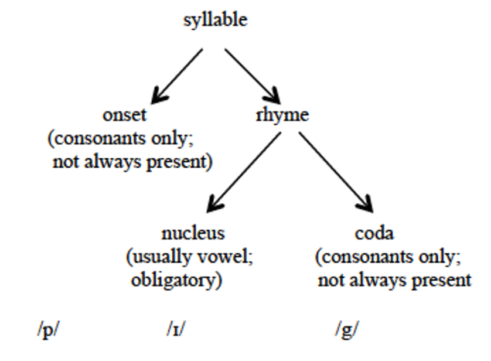

::: {.content-hidden when-format="revealjs"}
[Open slides version](slides.html){.btn .btn-primary}
:::

# Outline and recap

## Outline

1. [Phonetics vs phonology](#phonetics-vs-phonology): What's the difference between sounds we make and sound systems?
2. [Segmental phonology](#segmental-phonology): How do we identify the meaningful sound units of a language?
3. [Suprasegmental phonology](#suprasegmental-phonology): What patterns exist beyond individual sounds?
4. [Connected speech](#connected-speech): Why do sounds change when we speak naturally?

::: {.notes}
**10:15–10:17** (2 min)

Overview of today's session.
:::


## Recap

Last week we learned about **phonetics**:

- How to classify consonants (place, manner, voicing)
- How to classify vowels (height, backness, roundedness)
- How to transcribe English words in IPA
- Differences between RP and GA pronunciation

::: {.notes}
**10:17–10:18** (1 min)

Quick reminder of last week.
:::


# Segmental phonology {#segmental-phonology}

## Phonetics vs phonology {#phonetics-vs-phonology}


::: {.notes}
**10:18–10:20** (2 min)

Key distinction: phonetics studies concrete sounds, phonology studies sound systems.
:::


## Phonemes and phonology

@Kortmann2020Essentials: 37

"**Phonemes**: 

- Unlike phonetics, phonology is indisputably an integral part of linguistics. 
- It abstracts from the multitude of different sounds used in a language and is only interested in those sound units which fulfil a **meaning-distinguishing (distinctive or contrastive) function** within the sound system (therefore also the term functional phonetics). 
- These abstract, idealized sound units are called phonemes, and are defined as **smallest meaning-distinguishing units of a language**. 
- They exist only in our minds, however, more exactly in our mental grammar; on the **level of language use (parole)**, phonemes are always realized as phones."

::: {.notes}
**10:20–10:23** (3 min)

Core concept: phonemes are mental representations, phones are physical realizations.
:::


## Allophones

**Definition**: allophones are realisational variants of a phoneme.

**Example: /l/ in English** — two main allophones in **complementary distribution**:

::: {.columns}
:::: {.column}
**Clear [l]**

- Before vowels: *love*, *hello*
- Before /j/: *million*
- Context: "How do you *spell* it?"

::::
:::: {.column}
**Dark [ɫ]**

- Word-finally: *feel*, *spell*
- Before consonants: *bald*, *calls*
- Context: "Which word do you want me to *spell*?"

::::
:::

Allophones are in **complementary distribution** and **do not distinguish meaning**

::: {.notes}
**10:23–10:26** (3 min)

Example: clear vs dark /l/ - students often notice this unconsciously.
:::

---

### Distribution

::: {.small}
“**Complementary distribution**: 

- In the vast majority of cases, it is **predictable** in which phonological environment which allophone of a phoneme will be used. 
- This is known as complementary distribution of allophones, i. e. normally they never occur in the same environment; 
- thus, a given allophone cannot simply be replaced by one of the other allophones.” [@Kortmann2020Essentials: 38]

“**Free variation**: 

- In contradistinction to these so-called contextual variants, there are also numerous **free variants** of phonemes. 
- For instance, voiceless plosives may well be aspirated in the final position of a syllable or word, too, as in [læp] and [læpʰ] for lap, or [ʃʌt] and [ʃʌtʰ] for shut. 
- We are dealing with free variation of aspirated and non-aspirated allophones here." [@Kortmann2020Essentials: 38]
:::

::: {.notes}
**10:26–10:28** (2 min)

Complementary distribution vs free variation - brief explanation.
:::

---

### Minimal pairs

::: {.small}
@Kortmann2020Essentials: 38

“**Minimal pairs**: 

- The all-important method for determining the phonemes (versus (allo-)phones) of a language is the so-called minimal pair test. 
- Minimal pairs are pairs of meaning-carrying units which differ **in exactly one sound**, but apart from that have an identical sequence of sounds. 
- More exactly, such pairs qualify as minimal pairs only if they additionally **differ in their meaning**. 
- Since the meaning difference is only due to the sound difference, and the difference between the two relevant sounds therefore is distinctive, these two sounds must be ascribed **phoneme status**. 
- For example, on the basis of the minimal pairs in (6a) and the series of minimal pairs (minimal sets) in (6b), the following phonemes of English can be determined: /t/, /p/, /r/, /f/, /e/, /æ/, /iː/, /ɪ/, and /aɪ/. 

a. *ten*-*pen*, *time*-*rhyme*, *try*-*fry* 
b. *set*-*sat*-*seat*-*sit*-*site*" 
:::

::: {.notes}
**10:28–10:30** (2 min)

Key method for identifying phonemes.
:::

---

#### Exercise

Find minimal pairs for the following pairs of English phonemes:

1. /p/ – /b/
2. /iː/ – /uː/
3. /b/ – /m/
4. /n/ – /s/
5. /ɪ/ – /æ/

::: {.notes}
**10:30–10:35** (5 min)

Students work on finding minimal pairs. Discuss solutions briefly if shown.
:::

::: {.excl .slide}
:::: {.small}
1. /p/ – /b/: 
    - *pit* /pɪt/ – *bit* /bɪt/
    - *pack* /pæk/ – *back* /bæk/
2. /iː/ – /uː/: 
    - *beat* /biːt/ – *boot* /buːt/
    - *seat* /siːt/ – *suit* /suːt/
3. /b/ – /m/: 
    - *bat* /bæt/ – *mat* /mæt/
    - *ban* /bæn/ – *man* /mæn/
4. /n/ – /s/: 
    - *neat* /niːt/ – *seat* /siːt/
    - *no* /nəʊ/ – *so* /səʊ/
5. /ɪ/ – /æ/: 
    - *bit* /bɪt/ – *bat* /bæt/
    - *sit* /sɪt/ – *sat* /sæt/
::::
:::

---

## Minimal Pairs Quiz (Interactive)

```{=html}
<div style="width:100%;display:flex;flex-direction:column;gap:8px;min-height:635px;">
<iframe src="https://wayground.com/embed/quiz/691107f379d720f6b0bc6181" title="Minimal Pairs Quiz - Wayground" style="flex:1;" frameBorder="0" allowfullscreen></iframe>
</div>
```

::: {.notes}
**10:35–10:50** (15 min)

- 12 questions testing minimal pairs identification
- Mix of Yes/No questions, pair comparisons, and phoneme identification
- 20-25 seconds per question
:::


## Distinctive features

@Kortmann2020Essentials: 38–39

“**Distinctive features**: 

- In connection with the distinction between phonemes and allophones, a further central term of phonology becomes relevant, namely distinctive features. 
- Similar to the way we proceeded in the phonetic description of the various types of sounds, phonemes can alternatively be defined as bundles of distinctive features. 
- The phoneme /p/ could thus be described as a bundle of the features `[+ CONSONANT, – VOICED, – NASAL, + LABIAL, + CLOSURE, + PLOSIVE]`, 
- different from, for example, the nasal /n/ with its features `[+ CONSONANT, + VOICED, + NASAL, – LABIAL, + CLOSURE, – PLOSIVE]`." 

::: {.notes}
**10:50–10:52** (2 min)

**Mid-session break: 10:52–10:57** (5 min)
:::


# Suprasegmental phonology {#suprasegmental-phonology}

## Phonotactics

@Kortmann2020Essentials: 39

“**Phonotactics**: 

- Phonology does not only deal with those restrictions which concern the combination of distinctive features, but also with restrictions concerning the combination of phonemes in a language (socalled phonotactic restrictions). 
- Relevant examples are \<ps-\> – /s/, as in *psychology*, or \<kn-\> - /n/, as in *knight*. 
  - Whereas /k/ can occur before vowels (*king*, *castle*) and liquids (*cry*, *clay*) at the beginning of words in English, 
  - it is not found before other consonants that belong to the same syllable." 

::: {.notes}
**10:57–10:59** (2 min)

Phonotactic restrictions - what sound combinations are allowed.
:::

## Syllable structure



::: {.notes}
**10:59–11:01** (2 min)

Onset, nucleus, coda structure.
:::

---

### Exercise

Identify the onset, nucleus, and coda in each of the following monosyllabic words and indicate if the syllables are open or closed.

1. spread
2. glimpse
3. new

::: {.notes}
**11:01–11:04** (3 min) — **OPTIONAL: Skip if time is tight**

Can be skipped to save time. Move directly to word stress if needed.
:::

::: {.excl .slide}
|     | Word      | IPA      | Onset  | Nucleus | Coda  | Type   |
|----:|:----------|:---------|:-------|:--------|:------|:-------|
|  1. | *spread*  | /spred/  | /spr/  | /e/     | /d/   | closed |
|  2. | *glimpse* | /glɪmps/ | /gl/   | /ɪ/     | /mps/ | closed |
|  3. | *new*     | /njuː/   | /nj/   | /uː/    | —     | open   |
:::


## Word stress

**Basics:**

- Syllables can be **stressed** or **unstressed**
- Stressed syllables are perceived as more prominent (louder, longer, higher-pitched) than surrounding unstressed syllables

**Properties of English word stress:**

- **Free word stress** in English due to mixed vocabulary: *to ánswer*, *to decíde*
- **Primary vs secondary stress**: *èntertainment* /ˌentəˈteɪnmənt/
- **To a limited extent, English word stress is phonemic**, i.e. stress placement is meaning-distinguishing:
  - *ínsult* (noun) vs *insúlt* (verb)
  - *gréenhouse* (compound) vs *green hóuse* (phrase)

::: {.notes}
**11:04–11:07** (3 min)

Word stress can distinguish meaning - important concept.
:::

---


## Strong and weak forms {.small}

**Key principles:**

- Within an utterance or a sentence, there are more and less prominent words
- Stress tends to fall on those items that convey important information
- Therefore, **content words** usually receive stress, whereas **function words** are usually unstressed
- The alternative pronunciations of English function words are called **strong** and **weak** forms

**Examples:**

| Word   | Weak form        | Example              | Strong form | Example             |
|:-------|:-----------------|:---------------------|:------------|:--------------------|
| *and*  | /ənd/, /ən/, /n/ | *fish and chips*     | /ænd/       | It was him AND her. |
| *a*    | /ə/              | *take a look*        | /eɪ/        | Not A coat but THIS one. |
| *his*  | /ɪz/             | *take his dog*       | /hɪz/       | That was HIS dog.   |
| *could*| /kəd/            | *this could be true* | /kʊd/       | How COULD you?      |

::: {.notes}
**11:07–11:09** (2 min)

Function words reduce in unstressed positions.
:::

## Intonation {.small}

**Definition:**

- Linguistic use of **pitch**, **prominence**, and **pausing** to convey post-lexical meaning, i.e. it is not associated with the lexical, dictionary meaning of a word

**Functions:**

- **Emotional function**: expression of attitudinal meaning (e.g. sarcasm, shock)
  - *What a great idea!* (can be sincere or sarcastic)

- **Grammatical function**: organisation of an utterance into intonation phrases
  - *When danger threatens | your children call the police.*
  - *When danger threatens your children | call the police.*

- **Informational function**: drawing attention to important information (focus)
  - *Marianna made the cake (and not Thomas).*

::: {.notes}
**11:09–11:11** (2 min)

Intonation has three functions: emotional, grammatical, informational.
:::

# Connected speech {#connected-speech}

## Elision {.small}

**Definition**: omission of sounds in connected speech to make articulation easier

**Common types:**

**1. Consonant elision**: especially /t/ and /d/ in consonant clusters

- *next day* /neks deɪ/ (not /nekst deɪ/)
- *friendship* /frenʃɪp/ (not /frendʃɪp/)

**2. Vowel elision**: especially weak vowels in unstressed syllables

- *suppose* /spəʊz/ (not /səpəʊz/)
- *camera* /kæmrə/ (not /kæmərə/)

**3. /h/ dropping**: in unstressed function words

- *Give it to him* /gɪv ɪt tə ɪm/ (not /hɪm/)

::: {.notes}
**11:11–11:13** (2 min)

Elision makes speech easier to articulate.
:::

## Assimilation

**Definition**: the influence of one sound on the articulation of another sound

**Types:**

- **Progressive assimilation**: preceding sound influences following sound
  - *lunch score* [ˈlʌntʃ.ʃkɔː]

- **Regressive assimilation**: following sound influences preceding sound
  - *ten bottles* [tem ˈbɒtlz]

- **Reciprocal assimilation**: sounds influence each other
  - *kiss you* [ˈkɪʃuː]

::: {.notes}
**11:13–11:15** (2 min)

Three types of assimilation.
:::

---

### Exercise

::: {.small}
Consider the IPA symbols in bold print in the following transcriptions:

1. *decisive factor* [dɪˈsaɪsɪ**f** ˈfæktə]          
2. *chicken* [tʃɪk**ŋ**]          
3. *thing* [θ**ĩ**ŋ]
4. *commonwealth* [ˈkɒmə**m**welθ]          
5. *don't miss your train* [ˈdəʊnt ˈmɪ**ʃʃ**ə ˈtreɪn]
					
a. Which process is responsible for this variation in pronunciation?
b. What exactly is responsible for the sounds becoming more alike or even identical?
c. What do the above examples have in common with the form of the negative prefix in the following words: 

:::: {.columns}
::::: {.column width="50%"}
- *inadequate* [ɪnˈædɪkwət]
- *incomplete* [ˌɪŋkəmˈpliːt]
- *impossible* [ɪmˈpɒsibəl]
:::::
::::: {.column width="50%"}
- *immobile* [ɪˈməʊbaɪl]
- *illegal* [ɪˈliːgəl]
:::::
:::::
::::

::: {.notes}
**11:15–11:21** (6 min)
:::

::: {.excl .slide}
**a) The process is assimilation** — sounds become more similar or identical to neighbouring sounds.

**b) Types of assimilation in examples 1–5:**

| Example                   | Change       | Type of Assimilation              |
|:--------------------------|:------------|:----------------------------------|
| *decisive factor*         | v → f       | regressive – total                |
| *commonwealth*            | n → m       | regressive – partial              |
| *chicken*                 | n → ŋ       | progressive – partial             |
| *don't miss your train*   | sj → ʃʃ     | reciprocal – total                |
| *thing*                   | vowel → ĩ   | progressive – partial (nasalisation) |
:::

::: {.excl .slide}
**c) Connection to the negative prefix:**

- The realisation of the morpheme {in-} is **phonologically conditioned** by the following sound:
  - *inadequate* [ɪn-]: /n/ occurs before vowels or alveolars
  - *incomplete* [ɪŋ-]: /ŋ/ occurs before velar consonants (partial assimilation)
  - *impossible* [ɪm-]: /m/ occurs before bilabial consonants (partial assimilation)
  - *immobile* [ɪ-]: total assimilation before /m/ (nasal deleted, vowel lengthened)
  - *illegal* [ɪ-]: total assimilation before /l/ (nasal deleted)

- All cases represent instances of **regressive (anticipatory) assimilation**: the following sound alters the characteristics of the preceding sound. The place of articulation of the nasal adapts to match the following consonant.
:::


## Liaison and intrusion

Insertion of /r/ between vowels to prevent **hiatus** (especially in RP)

**1. Linking /r/**: pronouncing written 'r' before a vowel

- *far away* /fɑːr əˈweɪ/ (cf. *far* /fɑː/ in isolation)

**2. Intrusive /r/**: inserting /r/ where no 'r' exists in spelling

- *the idea is* /ði aɪˈdɪər ɪz/ (cf. *idea* /aɪˈdɪə/ in isolation)
- *law and order* /lɔːr ənd ˈɔːdə/

::: {.notes}
**11:21–11:24** (3 min)

RP-specific: linking r and intrusive r.
:::

---

#### Exercise

Read the following sentence pairs and describe the difference in the pronunciation (RP & GA) of the words in bold print:

1. How **far** can you see? – How **far is** it to London?
2. Can you **spare the** time? – Can you **spare a** moment?
3. He has an **idea for** his next book. – He gave me a rough **idea of** what was wanted.
4. Your argument has a **flaw**. – There's a **flaw in** your argument.

::: {.notes}
**11:24–11:28** (4 min) — **OPTIONAL: Skip or assign as homework if short on time**

This exercise can be skipped if you're running behind. The table in the solution captures the key points.
:::

::: {.excl .slide}
**Key concept**: GA is **rhotic** (/r/ always pronounced); RP is **non-rhotic** (/r/ only before vowels)

| Example    | Before consonant              | Before vowel                    | Type                  |
|:-----------|:------------------------------|:--------------------------------|:----------------------|
| 1. *far*   | RP: /fɑː/ vs GA: /fɑːr/       | Both: /fɑːr ɪz/                 | Linking r             |
| 2. *spare* | RP: /speə/ vs GA: /sper/      | Both: /spe(ə)r ə/               | Linking r             |
| 3. *idea*  | RP: /aɪˈdɪə/ vs GA: /aɪˈdiːə/ | Both: /aɪˈdɪər əv/              | Linking r             |
| 4. *flaw*  | RP: /flɔː/ vs GA: /flɑː/      | RP: /flɔːr ɪn/ vs GA: /flɑː ɪn/ | Intrusive r (RP only) |

**Note**: Intrusive r occurs in RP even when no 'r' is in the spelling (*flaw in*)
:::

---

## Phonology Review Quiz (Interactive)

```{=html}
<div style="width:100%;display:flex;flex-direction:column;gap:8px;min-height:635px;">
<iframe src="https://wayground.com/embed/quiz/69110c2e2ce8399612f6eb07" title="Phonology Review Quiz - Wayground" style="flex:1;" frameBorder="0" allowfullscreen></iframe>
</div>
```

::: {.notes}
**11:28–11:43** (15 min) — **KEEP THIS!**

- 13 questions covering suprasegmental phonology and connected speech
- Topics: syllable structure, word stress, strong/weak forms, connected speech processes
- 25-30 seconds per question
:::


# Summary and outlook

## Summary {.small}

**Segmental phonology:**

- **Phonemes**: smallest meaning-distinguishing units
- **Allophones**: realisational variants in complementary distribution
- **Minimal pairs**: words differing in one phoneme (*bit* – *bat*)

**Suprasegmental phonology:**

- **Syllable structure**: open (ends in vowel) vs closed (ends in consonant)
- **Word stress**: distinctive (*íncrease* N vs *incréase* V)
- **Strong/weak forms**: function words have alternative pronunciations
- **Intonation**: pitch, prominence, and pausing convey meaning

**Connected speech processes:**

- **Elision**: sound omission (*next day* [neks deɪ])
- **Assimilation**: sounds becoming similar (*ten men* [tem men])
- **Linking r** (RP): written 'r' pronounced before vowels (*far away*)
- **Intrusive r** (RP): /r/ inserted despite no 'r' in spelling (*law and order*)

::: {.notes}
**11:43–11:45** (2 min)

Quick summary and preview of next week.
:::

## Next week: Syntax I

Read @Herbst2010English: ch. 11.1–11.2


# References

:::: {#refs}
::::
