::: {.content-hidden when-format="revealjs"}
[open slides](slides.html){.btn .btn-primary} [download slides (pdf)](slides.pdf){.btn .btn-secondary}
:::

# Outline

# Syntax and grammar

## Sentence grammar

- “Syntax is concerned with the way in which words combine to form larger units such as sentences. 
- Although texts or utterances often consist of more than one sentence, it makes sense, for certain purposes of analysis at least, to consider the sentence the largest unit of description.”

[@Herbst2010English: 142]

## Syntactic hierarchy

- sentence 
  - clauses
    - phrases 
      - words 
        - morphemes

## Exercise: splitting into sentences, clauses, phrases, and words

Divide the following into sentences, clauses, phrases, and words:

*I gave them some money because they needed it.*

::: {.excl}
:::: {.r-stack}
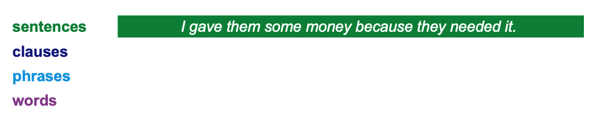{.fragment}

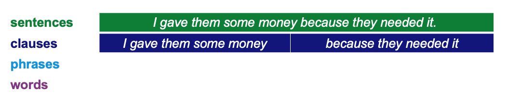{.fragment}

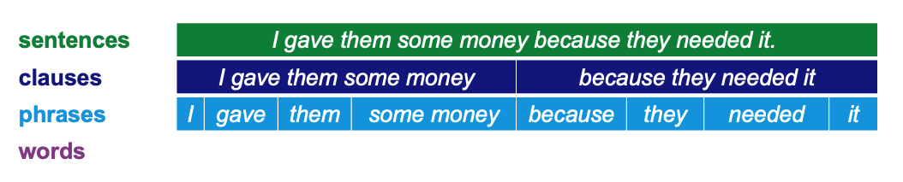{.fragment}

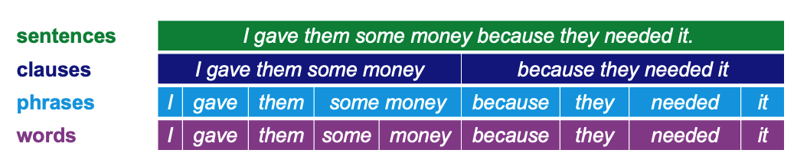{.fragment}
::::
:::

## Clauses and sentences {.small}

@Herbst2010English: 143–144; citing @Quirk1985Cambridge: 2.11

“[…] the **clause** is a much more clearly definable unit of linguistic analysis than the sentence. 

- A clause can occur as a **dependent** (or **subordinate**) clause if it forms a constituent of a larger clause as in 
  - (2)~PW~ *Barbara Hepworth had also begun to work in metal.*
- an **independent** clause if it is not a constituent of a larger clause as in 
  - (3)~PH~ *We shall now watch New York as eagerly as Paris for new developments.*

The term sentence will be used 

- for a **single independent clause** that is not co-ordinated with another clause as in (3)
- for a **combination of two or more independent clauses** in co-ordination as in 
  - (4)~PH~ *It was an October night and a full moon was rising over Godrevy.*

## Exercise: identifying clauses

Identify all dependent/subordinate and independent/main clauses in the following sentences:

1. *The cats have been asleep for days.*
2. *I admire their reasoning and I accept their conclusions.*
3. *Although I admire their reasoning, I reject their conclusions.*
4. *Playing the piano is great and I want to be brilliant at it.*
5. *His book stresses the history of styles, which he describes in sequence.*				

::: {.excl .slide}
1. *[The cats have been asleep for days.]^cl_main^*
2. *[I admire their reasoning]^cl_main^ and [I accept their conclusions]^cl_main^.*
3. *[[Although I admire their reasoning]^cl_sub^, I reject their conclusions]^cl_main^.*
4. *[Playing the piano is great]^cl_main^ and [I want to be brilliant at it]^cl_main^.*
5. *[His book stresses the history of styles, [which he describes in sequence]^cl_sub^]^cl_main^.*				
:::

## Example: full syntactic analysis

*His book stresses the history of styles, which he describes in sequence.*

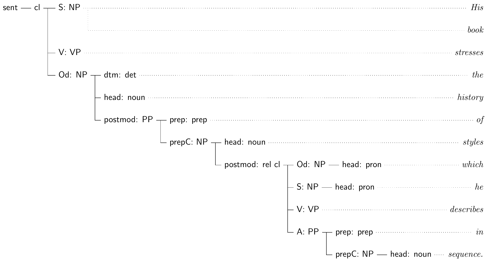

## Exercise: identifying finite and non-finite subordinate clauses

Indicate if the subordinate clauses in the following sentences are finite or non-finite:

1. *Playing the piano is great.*
2. *That we need a new banking settlement is clear.*
3. *Do you want to know whether I’m ‘anti’ or ‘pro’?*
4. *All they wanted was to see them one last time.*

::: {.excl .slide}
1. *[Playing the piano]^cl_sub_nonfin^ is great.*
2. *[That we need a new banking settlement]^cl_sub_nonfin^ is clear.*
3. *Do you want to know [whether I’m ‘anti’ or ‘pro’]^cl_sub_fin^?*
4. *[All they wanted]^cl_sub_fin^ was [to see them one last time]^cl_sub_nonfin^.*
:::

# The elements of clause structure

## Subject, predicate, adjunct

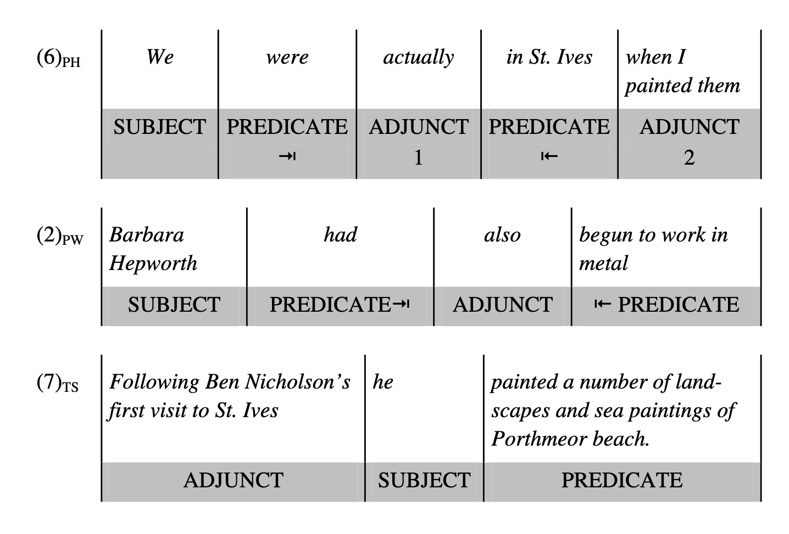

## Objects and complements

[@Herbst2010English: 149]

“The distinction between objects and complements is made on the basis of two main criteria: 

- objects can become the subjects of **passive** clauses, complements cannot 
- complements refer in some way to the **subject** or **object** of the clause (hence the distinction between subject complements and object complements), objects do not.” 

## Form and function

*The cats have been asleep for days.*

::: {.excl .fragment}
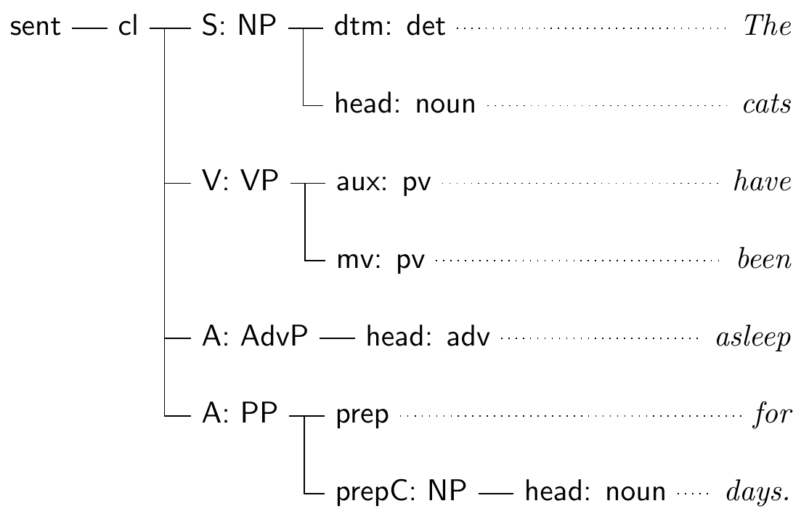{height="400px"}
:::

## Exercise; identifying the elements of clause structure

Identify the elements of clause structure in the following sentences.

1. *The driver gave them a free ride.*
2. *They have been reading for a while.*
3. *I might be here again next month.*
4. *Kevin is very afraid of dogs.*
5. *Some people consider them the best band on earth.*
6. *Honestly, I did see him briefly in the park yesterday when he was feeding the ducks.*

::: {.excl .slide}
1. *The driver^S:NP^ gave^V:VP^ them^Oi:NP^ a free ride^Od:NP^.*
2. *They^S:NP^ have been reading^V:VP^ for a while^A:AdvP^.*
3. *I^S:NP^ might be^V:VP^ here^A:AdvP^ again^A:AdvP^ next month^A:NP^.*
4. *Kevin^S:NP^ is^V:VP^ very afraid of dogs^Cs:AdjP^.*
5. *Some people^S:NP^ consider^V:VP^ them^Oi:NP^ the best band on earth^Od:NP^.*
6. *Honestly^A:Adv^, I^S:NP^ did see^V:VP^ him^Od:NP^ briefly^A:Adv^ in the park^A:AdvP^ yesterday^A:AdvP^ when he was feeding the ducks^A:cl_sub_fin^.*
:::

## Clause types

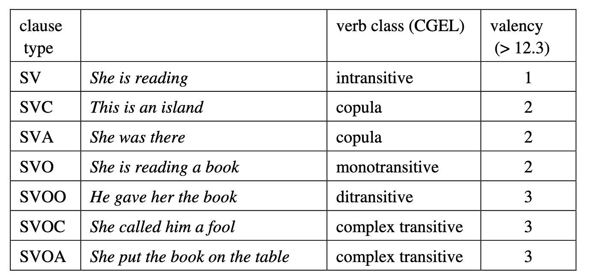

## Exercise: matching clause types

Match the following sentences with the correct clause type (CGEL):

::: {.columns}
:::: {.column width="70%"}
1. *She – was reading.*
2. *We – were – too early.*
3. *We – sent – them – a parcel.*
4. *He – became – the President of the United States.*
5. *I – read – a book.*
6. *I – put – the book – on the shelf.*
7. *We – find – clause patterns – fascinating.*
::::
:::: {.column width="30%"}
a. SV
b. SVO~d~
c. SVO~i~O~d~
d. SVC~s~
e. SVA
f. SVO~d~C~o~
g. SVO~d~A
::::
:::

::: {.excl .slide}
1. *She – was reading.*: **SV**
2. *We – were – too early.*: **SVC~s~**
3. *We – sent – them – a parcel.*: **SVO~i~O~d~**
4. *He – became – the President of the United States.*: **SVC~s~**
5. *I – read – a book.*: **SVO~d~**
6. *I – put – the book – on the shelf.*: **SVO~d~A**
7. *We – find – clause patterns – fascinating.*: **SVO~d~O~d~**
:::

## Exercise: identifying dependent/subordinate clauses

Underline all dependent/subordinate clauses in the sentences below and determine their syntactic function.

1. *That cities will attract more and more criminals is a safe prediction.*
2. *This shows how difficult the question must have been.*
3. *Being a farmer, he is suspicious of all governmental interference.*
4. *We knew that he was a lousy driver.*
5. *The problem is who will water my plants when I am away.*
6. *No further discussion arising, the meeting was brought to a close.*

::: {.excl .slide}
1. *[That cities will attract more and more criminals]^cl_sub_fin^ is a safe prediction.*
2. *This shows [how difficult the question must have been]^cl_sub_fin^.*
3. *[Being a farmer]^cl_sub_nonfin^, he is suspicious of all governmental interference.*
4. *We knew [that he was a lousy driver]^cl_sub_fin^.*
5. *The problem is [who will water my plants when I am away]^cl_sub_fin^.*
6. *[No further discussion arising]^cl_sub_nonfin^, the meeting was brought to a close.*
:::

# Phrases

## Noun phrases

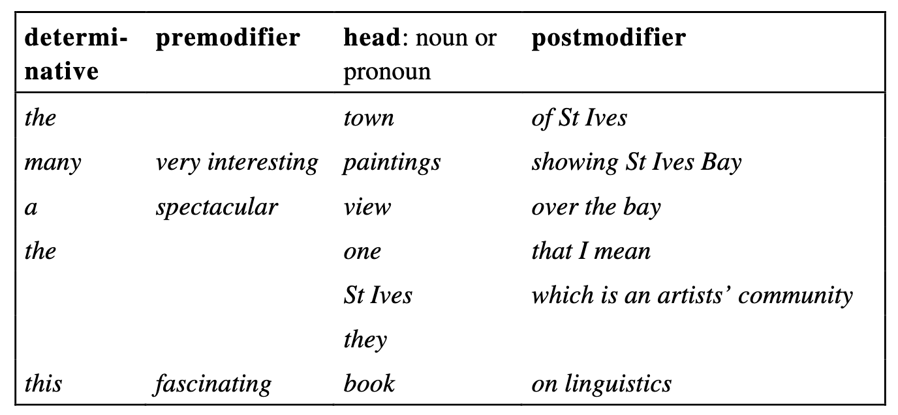

## Verb phrases

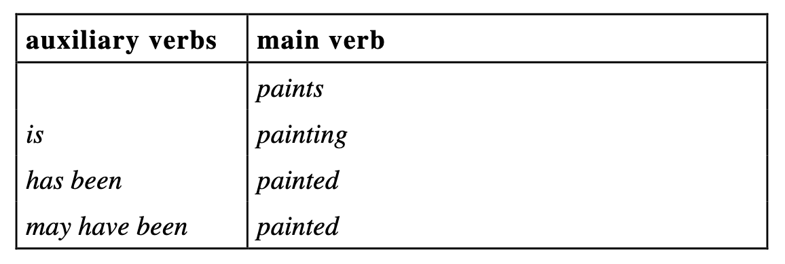

## Adjective phrases

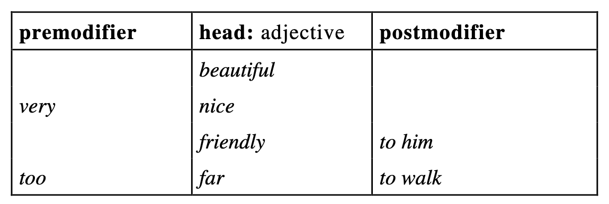

## Adverb phrases

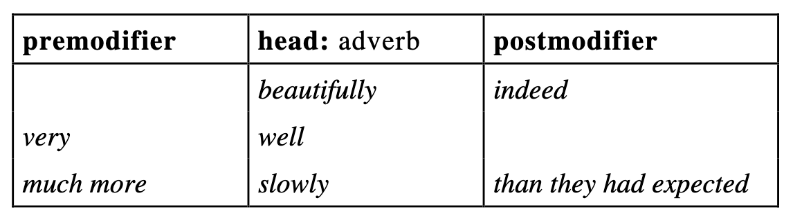

## Prepositional phrases

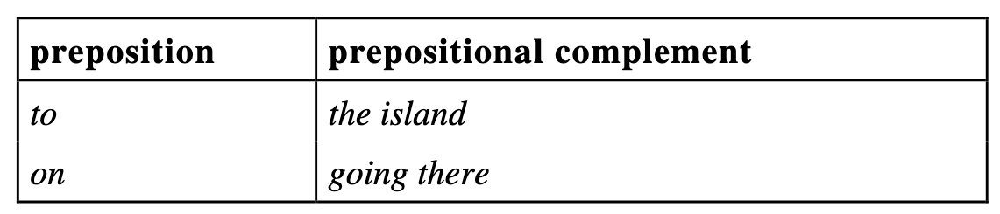

## Exercise: identifying noun phrases

Identify all noun phrases in the following sentences.

1. *The driver gave them a free ride.*
2. *I might be here again next month.*
3. *October arrived, spreading a damp chill over the grounds and into the castle.*
4. *The bassist they had just casted left the next day.*

::: {.excl .slide}
1. *[The driver]{.underline} gave [them]{.underline} [a free ride]{.underline}.*
2. *[I]{.underline} might be here again [next month]{.underline}.*
3. *[October]{.underline} arrived, spreading [a damp chill]{.underline} over [the grounds]{.underline} and into [the castle]{.underline}.*
4. *[The bassist]{.underline} [they]{.underline} had just casted left [the next day]{.underline}.*
:::

## Exercise: identifying verb phrases

Identify all verb phrases in the following sentences.

1. *The driver gave them a free ride.*
2. *I might be here again next month.*
3. *They have been reading for a while.*
4. *The bassist might have been leaving.*

::: {.excl .slide}
1. *The driver [gave]{.underline} them a free ride.*
2. *I might [be]{.underline} here again next month.*
3. *They [have been reading]{.underline} for a while.*
4. *The bassist might [have been leaving]{.underline}.*
:::

## Exercise: identifying phrase types

Give the term for the formal elements (= phrases) underlined in the following sentences.

1. *I might be [here]{.underline} [again]{.underline} next month.*
2. *They left [in a rush]{.underline}.*
3. *They did [amazingly well]{.underline}.*
4. *[The man who came here yesterday]{.underline} was his brother.*
5. *Charlie is [very anxious about their health]{.underline}.*
6. *She fell in love with [the girl in the dark grey dress]{.underline}.*

::: {.excl .slide}
1. *I might be [here]{.underline} (**AdvP**) [again]{.underline} (**AdvP**) next month.*
2. *They left [in a rush]{.underline} (**AdvP**).*
3. *They did [amazingly well]{.underline} (**AdvP**).*
4. *[The man who came here yesterday]{.underline} (**NP**) was his brother.*
5. *Charlie is [very anxious about their health]{.underline} (**AdjP**).*
6. *She fell in love with [the girl in the dark grey dress]{.underline} (**NP**).*
:::

# Word classes

## Overview

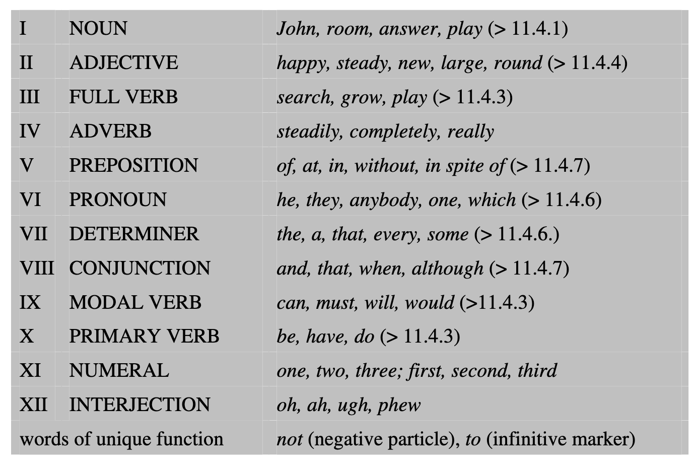

::: {.notes}
- 1–4: open classe
- 4–: closed classes
:::

## Exercise: determining word classes

Determine the word class of all the words in the following sentences taken from Harry Potter and the Chamber of Secrets.

*October arrived, spreading a damp chill over the grounds and into the castle. Madam Pomfrey, the nurse, was kept busy by a sudden spate of colds among the staff and students. Her […] potion worked instantly, though it left the drinker smoking at the ears for several hours afterward.*

::: {.excl .slide}
*October^n_prop^ arrived^v_full^, spreading^V_full^ a^det^ damp^adj^ chill^n^ over^prep^ the^det^ grounds^n^ and^conj^ into^prep^ the^det^ castle^n^. Madam Pomfrey^n_prop^, the nurse^n^, was^v_prim^ kept^v_full^ busy^adj^ by^prep^ a^det^ sudden^adj^ spate^n^ of^prep^ colds^n^ among^prep^ the^det^ staff^n^ and^conj^ students^n^. Her^det^ […] potion^n^ worked^v_full^ instantly^adv^, though^conj^ it^pron_pers^ left^v_full^ the drinker^n^ smoking^v_full^ at^prep^ the^det^ ears^n^ for^prep^ several^det^ hours^n^ afterward^adv^.*
:::

## Verbs

### Verbal inflection

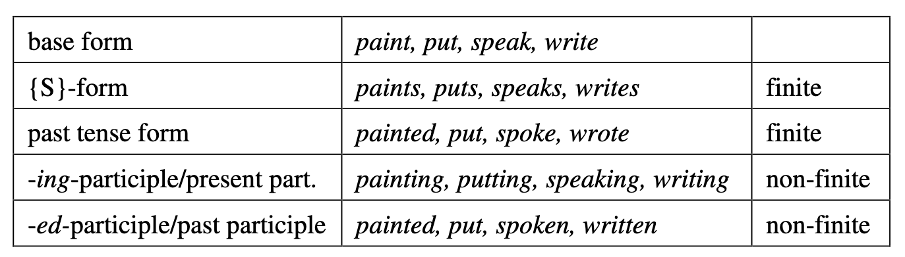

---

### Modal and primary verbs

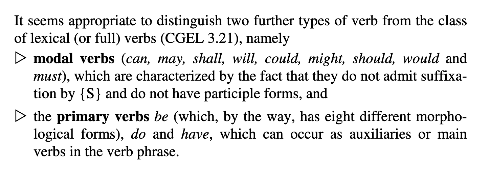

# Full syntactic analysis

Give a full syntactic analysis of the following sentences.

## *He spends all his money on horses.*

::: {.excl .fragment}
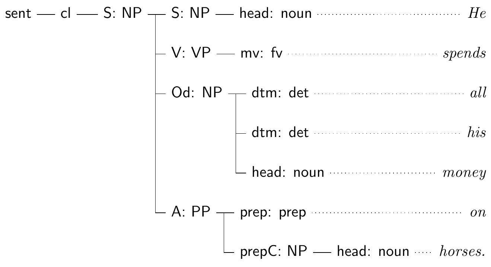
:::

## *John called me an idiot.*

::: {.excl .fragment}
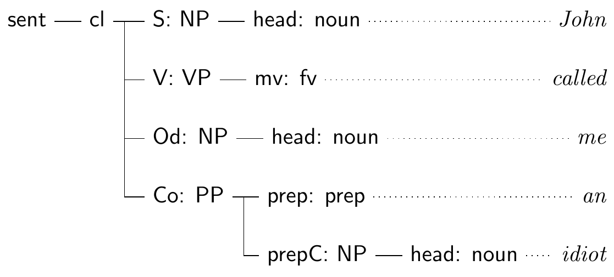
:::

## *Mary left the next day.*

::: {.excl .fragment}
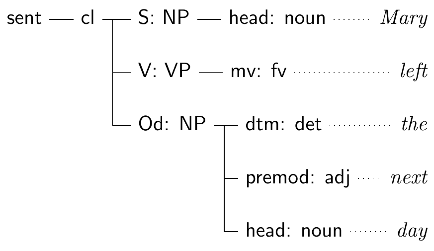
:::

## *His face turned pale when he saw me.*

::: {.excl .fragment}
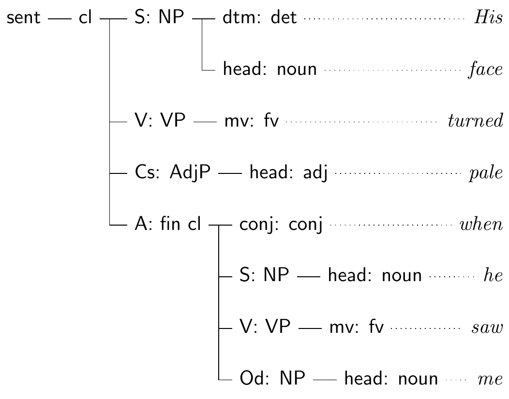{height="500px"}
:::

## *Tom called Jerry at midnight and Tom called Jerry a fool.*

::: {.excl .fragment}
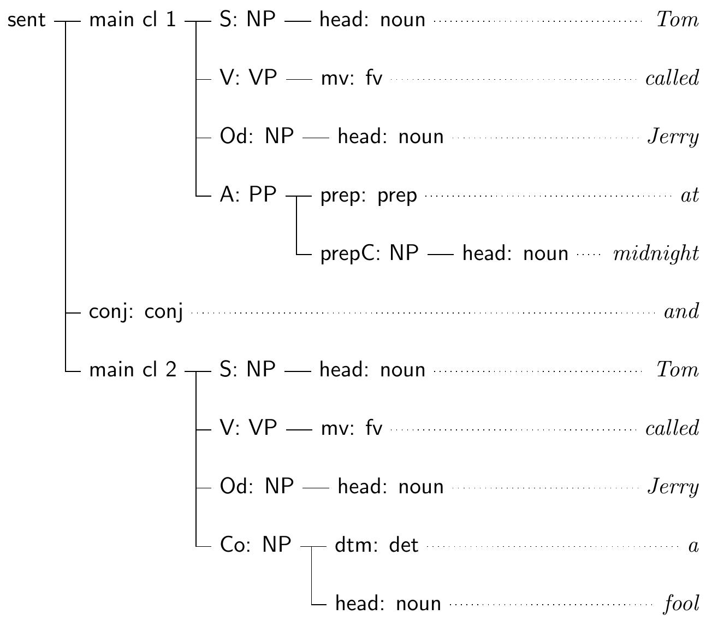{height="500px"}
:::

## *Some people consider themselves to be very important.*

::: {.excl .fragment}
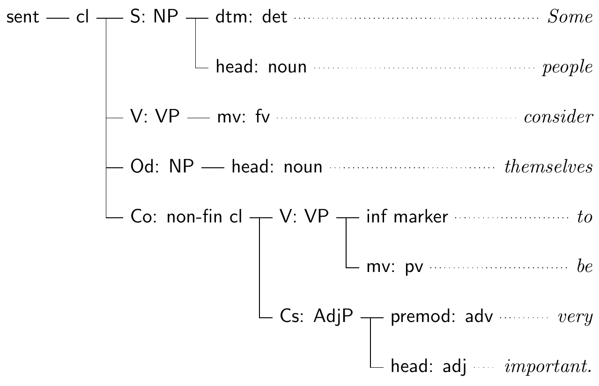{height="500px"}
:::

## *Michael completely ruined the dinner as he behaved like a fool.*

::: {.excl .fragment}
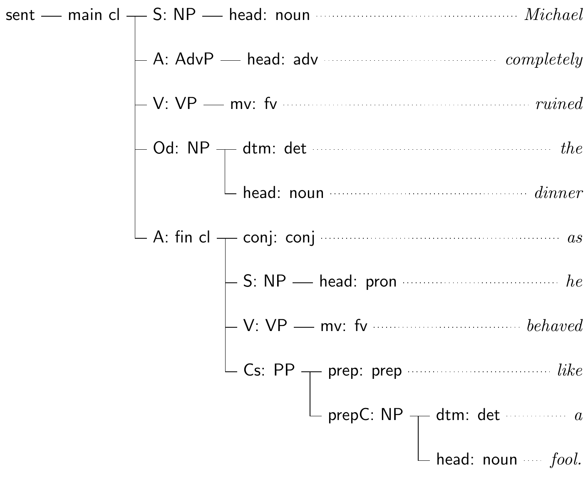{height="500px"}
:::

## *The door of George Lancaster’s house, which was half buried in the snow, screeched.*

::: {.excl .fragment}
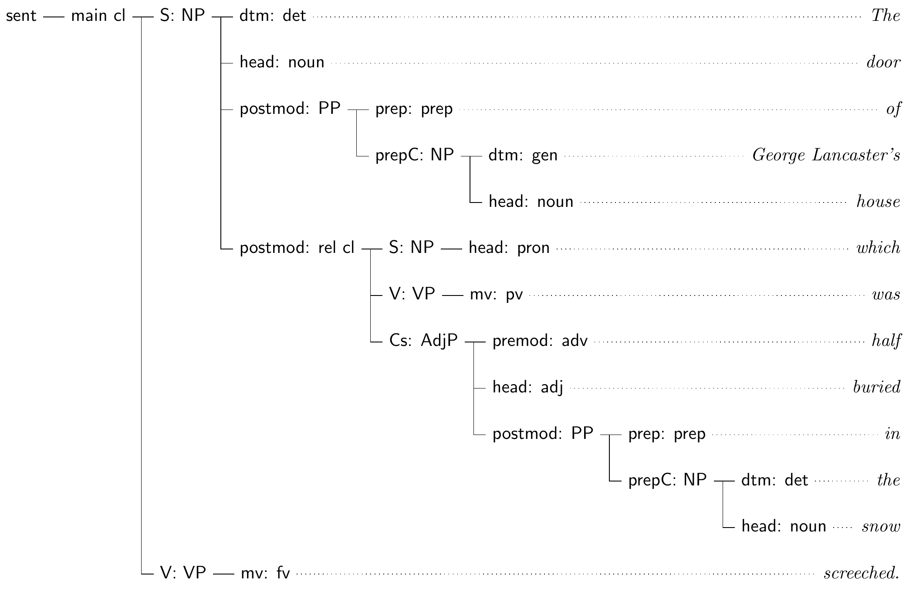{height="500px"}
:::

## *The lucky boys have found a paperback in the park and they opened it carefully.*

::: {.excl .fragment}
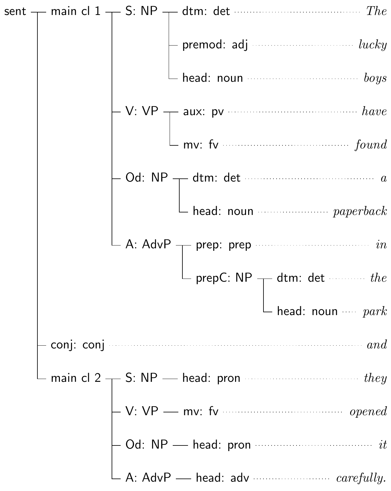{height="500px"}
:::

# Valency theory and case grammar

## Constituency grammar

*By 1918 St Ives had a long tradition as an artists’ community.*

. . .

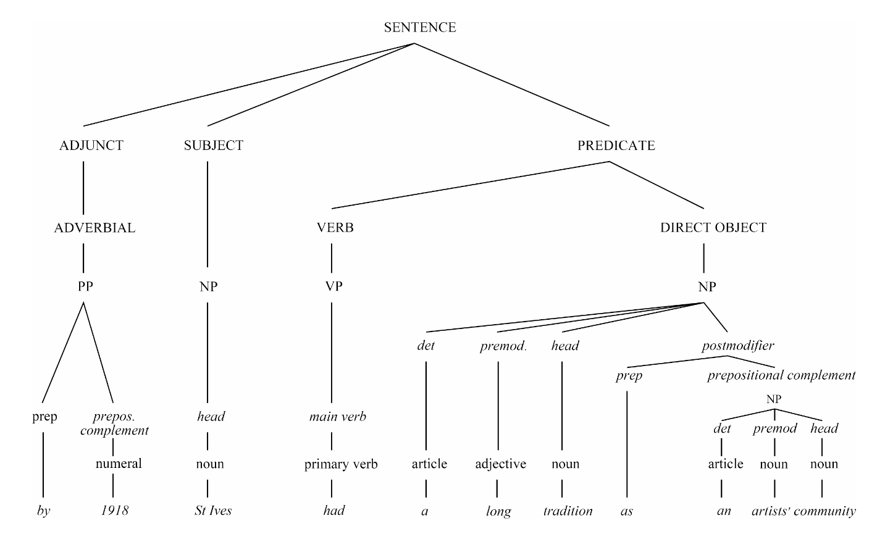{height="500px"}

## Dependency grammar

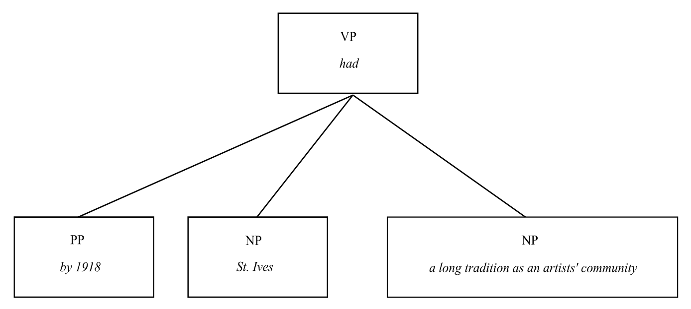

## Case grammar and participant roles {.smaller}

@Herbst2010English: 180–182

- **BENREC**: someone or something that benefits from the action expressed by the verb or is the intended recipient of the action described by the verb
  - (12)~PW~ *It gave [Ben]{.underline} a reasonable studio and [Barbara]{.underline} one near the kitchen, filled with light.* 
- **ÆFFECTED**: something (or someone) that is affected by or is the outcome or result of the action described by the verb 
  - (15)~PH~ *Once there, Heron had immediately started [work on a series of small vertical paintings]{.underline} …*
- **PREDICATIVE**: identification, equation, characterization or description (which could be seen as subroles of ‘PREDICATIVE’): 
  - (19)~PH~ *Heron has never been [a programmatic artist]{.underline} …*
- **LOCATIVE: STATIVE**: 
  - (16)~PH~ *[At Zennor]{.underline} one sees infinite Atlantic …*
- **LOCATIVE: GOAL**: 
  - (20)~PH~ *… Heron moved beyond the rapid summary strokes and washes of the ‘stripe’ and ‘horizon’ paintings [towards what he described as a ‘true spontaneity’]{.underline} …*

---

::: {.small}
- **LOCATIVE: SOURCE**: 
  - (22)~PH~ *… Heron moved [beyond the rapid summary strokes and washes of the ‘stripe’ and ‘horizon’ paintings]{.underline} towards what he described as a ‘true spontaneity’ …*
- **TIME**: time of the action described by the verb:
  - (21)~PH~ *[Exactly forty years before]{.underline} D.H. Lawrence had moved into Higher Tregerthen, the tiny group of cottages at the bottom of the hill below Eagles Nest …*
- **PURPOSE**: 
  - (24)~PW~ *[In order to realize the subject emotionally and to further his understanding of the composition,]{.underline} Lanyon made use of his practical skills in a number of three-dimensional constructions.*
- **TOPIC**: 
  - (25)~PH~ *Heron had, of course, been thinking and writing [about the nature of abstraction]{.underline} since his very first published article in 1945 …*
- **AGENT**: someone that carries out an action: 
  - (26)~PH~ *[Heron]{.underline} had, of course, been thinking and writing about the nature of abstraction since his very first published article in 1945 …*
:::

# References

:::: {#refs}
::::
