::: {.content-hidden when-format="revealjs"}
[open slides](slides.html){.btn .btn-primary} [download slides (pdf)](slides.pdf){.btn .btn-secondary}
:::

# Object of study

## Semantics

- “Semantics (Greek semain- = to mean) is the only branch of linguistics which is exclusively concerned with **meaning**. 
- Semantics studies the meaning or meaning potential of various kinds of expressions: **words**, **phrases**, and **sentences**. 
- This chapter is mainly confined to the study of **word meaning** (**lexical semantics**; **lexicology**)” [@Kortmann2020Essentials: 143]


## Semasiology and onomasiology

### Semasiology 

- What is the meaning of X?”
- form/signifier → meaning/signified

### Onomasiology

- What is the word for X?”
- meaning/signified → form/signifier


## Paradigmatic and syntagmatic semantics

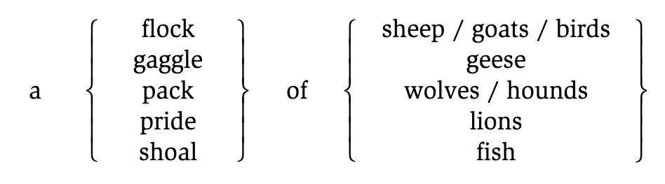{width=500}


## Reference — referent

- “The term **reference**, for example, designates the relation between entities in the external world and the words which are used to refer to these entities (e. g. people, objects, events, places, points in time, etc.). 
- The **referent** is the entity referred to (“picked out”) by an expression in a particular context. 

4a. Take the bottle and put it in the dustbin.\
4b. She took a bottle and put it in a dustbin.\
4c. A bottle is not a dustbin.”

[@Kortmann2020Essentials: 147]


## Extension — denotation

- “The term **extension** designates the class of objects to which a linguistic expression can be applied, i. e. the class of its potential referents (in (4c) the class of all bottles and the class of all dustbins). 
- A **referent** of a linguistic expression is always a member (or subset) of the class of objects that constitutes the word’s **extension**.” 

[@Kortmann2020Essentials: 147]


## Denotation — connotation

- **Denotation**: the literal, dictionary meaning of a word; its core, objective meaning
- **Connotation**: the emotional, cultural, or associative meaning that goes beyond the literal meaning; subjective and context-dependent

### Examples

- *cheap* vs *inexpensive*
    - Both denote low cost, but *cheap* often connotes poor quality, while *inexpensive* is more neutral.
- *slender* vs *skinny* vs *thin*
    - All denote lack of body mass, but *slender* is positive, *skinny* can be negative, and *thin* is more neutral.


## Lexical fields

[@Kortmann2020Essentials: 149]

“**Lexical (or: semantic) fields** are groups of words which cover different or partly overlapping areas within the **same extralinguistic domain**.” 

### Examples

- “colour adjectives, 
- adjectives relating to mental abilities (*intelligent*, *clever*, *smart*, *bright*, *brilliant*, *brainy*, *stupid*, *dumb*, *silly*, *thick*, *dense*, etc.), 
- different types of footwear (*shoe*, *moccasin*, *clog*, *slipper*, *sandal*, *trainer*, *boot*, etc.)” 

[Can you think of lexical fields that have undergone lexical change in the recent past?]{.fragment}

::: {.notes}
*telephone*, *phone*, *mobile phone*, *smartphone*
:::

---

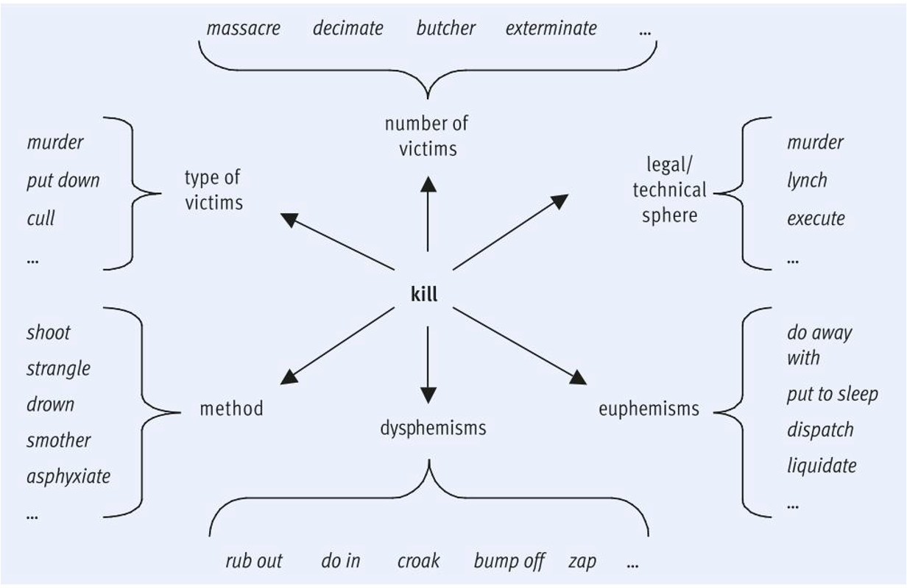


# Meaning relations

## Overview of sense relations

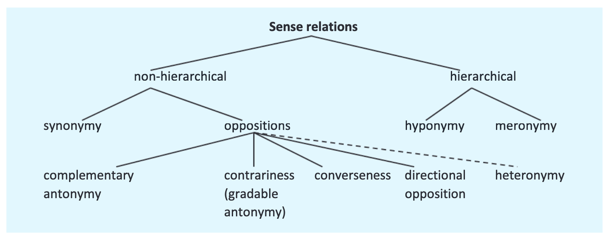


## Synonymy

[@Kortmann2020Essentials: 152]

- “**Synonymy**: The concept of synonymy is used to describe semantic **equivalence** or rather **extensive semantic similarity** between two or more lexemes. 
- The term is typically used in reference to the **descriptive meaning** of words (hence the term descriptive or cognitive synonymy). Synonyms thus have the same semantic features.” 

---

“**Descriptive synonyms** may differ with regard to 

- their **connotations** (*dog* – *mongrel*, *cock* – *rooster*, *worker* – *employee*, *baby* – *neonate*), 
- with regard to **stylistic level** or **register** (*begin* – *commence*, *buy* – *purchase*, *intoxicated* – *drunk* – *pissed*), 
- with regard to **regional** or **social variety** (e. g. differences between American and BritishEnglish*), 
- or with regard to their **collocations** (e. g. *a big/large house*, but *Big/Large Brother* is watching you).” 


## Complementary antonymy

[@Kortmann2020Essentials: 152]

- “Complementary antonymy: We speak of **complementary** or **binary antonyms** (or: complementaries) if there is an either-or relationship between the two terms of a pair of semantic opposites, i. e. if the two antonyms exhaust all possible options in a particular conceptual domain 
- (e.g. *asleep* – *awake*, *dead* – *alive*, *live* – *die*, *pass* – *fail*).


## Gradable antonymy

- “(Gradable) antonymy: Complementary antonymy is commonly contrasted with gradable antonymy, where the two expressions involved merely constitute **opposite poles of a continuum**.” 
- “**Examples** of gradable antonyms are *hot* – *cold* (notice the various intermediate stages like *warm* – *tepid* – *cool*), *broad* – *narrow*, *large* – *small*,-and *old* – *young* (cf. also pairs of nouns like *beginning* – *end*, *war* – *peace*).” 


## Relational opposites

[@Kortmann2020Essentials: 153]

- “**Relational opposites**: A further type of antonyms are relational opposites (or: converses). 
- They describe the **same situation from different perspectives** 

### Examples

- *teacher* ⇆ *pupil*
- *employer* ⇆ *employee*
- *examiner* ⇆ *examinee*
- *older* ⇆ *younger*
- *longer* ⇆ *shorter*


## Directional opposites

[@Kortmann2020Essentials: 153]

“**Directional oppositeness**: The fourth type of antonymy, directional oppositeness (directional opposites or reverses), does not involve different perspectives on the same situation, but rather a **change of direction** (especially motion in different directions). 

### Examples

::: {.small}
- *open* ⇆ *shut*
- *push* ⇆ *pull*
- *rise* ⇆ *fall*
- *leave* ⇆ *return*
- *(turn) right* ⇆ *(turn) left*
- *tie* ⇆ *untie*
:::


## Hierarchical relations: hyponomy and meronomy

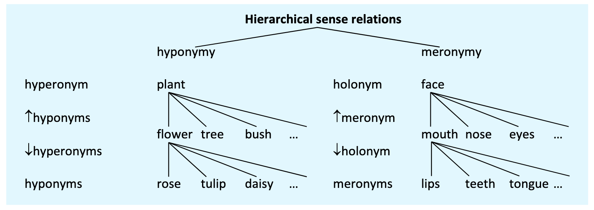


## Exercise: identify sense relations {.small}

Identify the meaning relation holding between the following pairs of words. 
For antonyms, specify the subtype.

1. *frame* – *window*: [**meronymy**: meronym: *frame*, holonym: *window*]{.excl .fragment}
2. *expand* – *contract*: [**directional antonymy**]{.excl .fragment}
3. *(go) in* – *(go) out*: [**directional oppositeness**]{.excl .fragment}
4. *freedom* – *liberty*: [**descriptive synonymy**]{.excl .fragment}
5. *hot* – *cold*: [**gradable antonymy**]{.excl .fragment}
6. *insect* – *bee*: [**hyperonymy**: hyperonym: *insect*, holonym: *bee*]{.excl .fragment}
7. *certain* – *sure*: [**total/descriptive synonymy**]{.excl .fragment}
8. *night* – *day*: [**complementary antonymy**]{.excl .fragment}
9. *give* – *receive*: [**relational oppositeness**]{.excl .fragment}
10. *poor* – *rich*: [**polar antonymy**]{.excl .fragment}
11. *peace* – *war*: [**complementary antonymy**]{.excl .fragment}
12. *car* – *convertible*: [**hyperonymy**: hyperonym: *car*, hyponym: *convertible*]{.excl .fragment}
13. *house* – *cottage* – *palace*: [**co-hyponyms** of the hyperonym *building*]{.excl .fragment}


## Syntagmatic relations: collocations and idioms

- **Collocations** 
    - words that occur together more **frequently** than expected
    - examples: *salt and pepper*, *handsome man* (vs. ^?^*handsome girl*)
- **Idioms** 
    - words that occur together more **frequently** than expected
    - **semantically opaque** (non-transparent), i.e. meaning not deducible from meanings of the components
    - examples: *to kick the bucket*, *to break a leg*, *to put one's foot in one's mouth*

---

### Exercise: collocations and idioms

::: {.small}
Briefly explain the difference between collocations and idioms. 

1. *kick the bucket*
    - [**idiom**: non-compositional meaning ('to die')]{.excl .fragment}
2. *break a habit*
    - [**collocation**: words that commonly occur together, but meaning is literal]{.excl .fragment}
3. *break a leg*
    - [**idiom**: non-compositional meaning ('good luck')]{.excl .fragment}
4. *hang in there*
    - [**idiom**: non-compositional meaning ('persevere', 'don't give up')]{.excl .fragment}
5. *white wine*
    - [**collocation**: words that commonly occur together, but meaning is literal]{.excl .fragment}
6. *blond hair*
    - [**collocation**: words that commonly occur together, but meaning is literal]{.excl .fragment}
:::


# Lexical ambiguity

## Homonymy vs polysemy

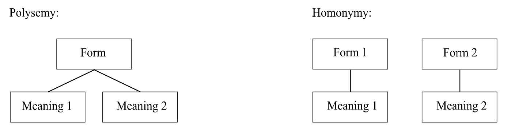


## Homonymy

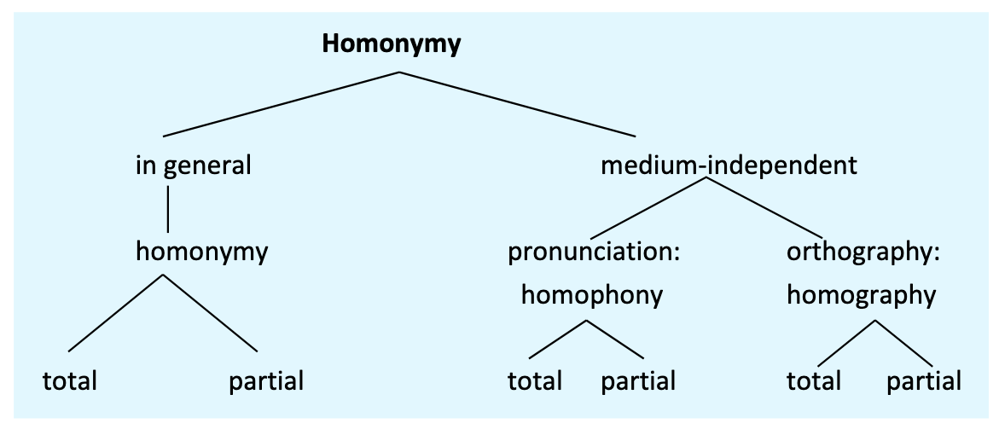

::: {.small}
- “**Homophones** are lexemes which are identical in pronunciation, but differ in spelling 
    - (see – sea, sight – site, flower – flour), 
- while **homographs** are identical in spelling, but differ in pronunciation 
    - (*lead* /led/ ‘kind of metal’ vs. *lead* /liːd / ‘piece of leather attached to dogs’ collars’, 
    - *bass* /beɪs/ ‘man with a deep singing voice’ vs. *bass* /bæs/ ‘type of fish’).” [@Kortmann2020Essentials: 153]
:::

---

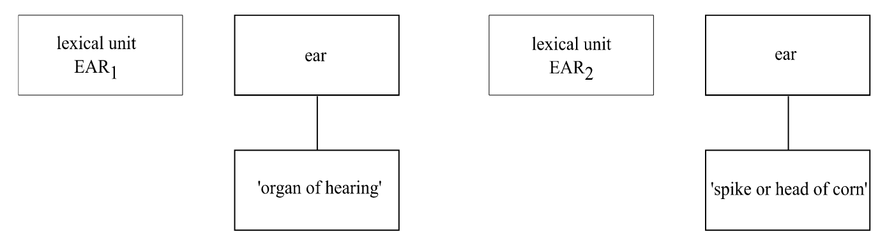


## Exercise:

Describe the lexical ambiguity of the words below using the following linguistic terms:

[polysemy – homonymy – homophony – homography]{.smallcaps}

1. *bass* – ‘music instrument’ vs. ‘type of fish’: [**homography**]{.excl .fragment}
2. *mouse* – ‘small rodent’ vs. ‘computer mouse’: [**polysemy**]{.excl .fragment}
3. *see* – *sea*: [**homophony**]{.excl .fragment}


# Cognitive semantics

## Componential analysis

**Structural semantics**: Description of any word meaning as a **combination of semantic components** (cf. phonemes: any phoneme in any language can be described with a limited set of distinctive features).

- lexemes differ with regard to their distinctive features
- **seme**: smallest distinctive feature of meaning
- **semem**: entire set of semes of a word

|                     | *man* | *woman* | *boy* | *girl* | *cow* | *bull* |
|:--------------------|:-----:|:-------:|:-----:|:------:|:-----:|:------:|
| [male]{.smallcaps}  |   +   |    –    |   +   |   –    |   –   |   +    |
| [adult]{.smallcaps} |   +   |    +    |   –   |   –    |   +   |   +    |
| [human]{.smallcaps} |   +   |    +    |   +   |   +    |   –   |   –    |


## Prototype theory {.small}

::: {.columns}
:::: {.column width="50%"}
**Basic assumption**: Not all members of a category are equally good members, e.g. a prototypical member of a bird is a robin, not an ostrich.

**Prototypical & marginal members**: 

- The member that exhibits the most salient features is the **prototype** (i.e., best, most representative member) of the category. 
- Depending on the **degree of resemblance** an entity bears to the prototype, it will be categorised as good, more marginal or no member of the category (e.g., *dove* – *duck* – *penguin* – *bat* – *cow*).

In **experiments**, test persons categorise prototypical members faster as member of the category than they do with marginal members.
::::
:::: {.column width="50%"}
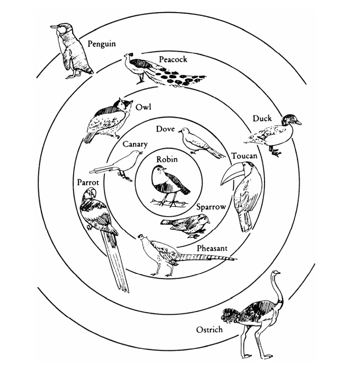{height=400}

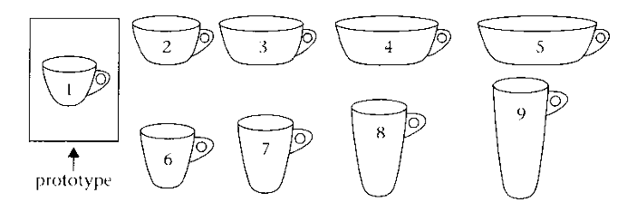{height=150}
::::
:::


# Metaphor and metonymy

## Metaphor

[@Kortmann2020Essentials: 161]

- “Vehicle – tenor – tertium comparationis: The term **metaphor** (Greek metaphero = ‘carry somewhere else’, with the noun *metaphora* already in its modern meaning) traditionally refers to a figure of speech which is based on a relationship of **similarity** or **analogy** between two terms from **different cognitive domains**. 
- This similarity, which may be objectively given or merely subjective, is typically held to enable metaphors to ‘transport’ one or more properties of a (usually relatively concrete) **source domain** (or: vehicle) to a **target domain** (or: tenor), which is typically more abstract. 
- The similarities involved in metaphorical mappings are often called the **tertium comparationis** (or ground). 

---

### Examples

- animal metaphors 
    - (*Smith is a pig / fox / rat / ass / stallion*), 
- synaesthetic metaphors (extensions from one field of sensory perception to another, 
    - e.g. in *loud colours*, *soft / warm / sharp voice*), 
- and so-called anthropomorphic metaphors (transfers from the human domain, especially human body parts, to all sorts of non-human domains, 
    - e.g. *leg of a table*, *arm of a river*, *face / hands of a clock*, *foot of a mountain*, *mouth of a river*).” 

---

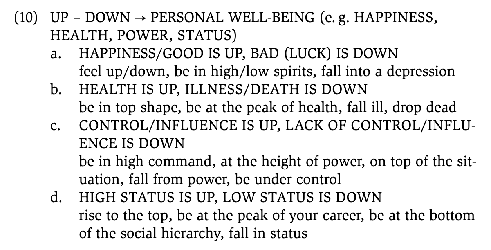{width=550}


## Metonymy

[@Kortmann2020Essentials: 163]

- “The main difference between metaphor and **metonymy** is this: Metonymies do not involve a transfer from one cognitive domain to another. 
- They are rather based on an existing objective connection between two “**contiguous**” phenomena, such that one phenomenon stands for the other. 
- Thus, metonymies are not based on a relationship of similarity, but of contiguity: The phenomena or entities concerned are part of the same situation or, more generally, part of the **same conceptual structure**.” 

---

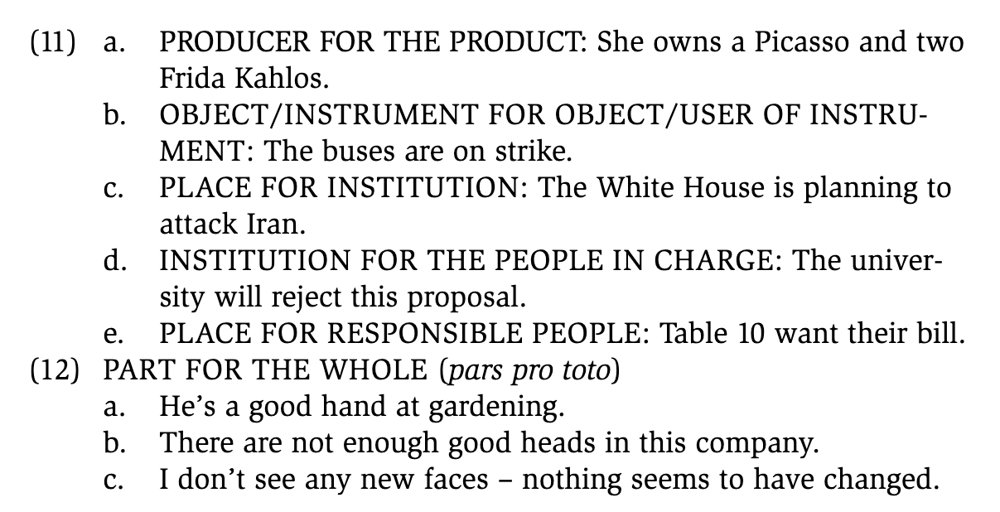{width=550}


## Exercise: identify metaphor and metonymy {.small}

Which of the following examples contain conceptual metaphors and which conceptual metonymies? Explain.

1. *They are the brightest students in the class.*

::: {.excl .fragment}
- **metaphor**
    - source domain: [light/brightness]{.smallcaps}
    - target domain: [intelligence]{.smallcaps}
:::

2. *The argument collapsed.*

::: {.excl .fragment}
- **metaphor**
    - source domain: [physical structures/buildings]{.smallcaps}
    - target domain: [arguments]{.smallcaps}
:::

3. *The trains are on strike.*

::: {.excl .fragment}
- **metonymy**
    - *trains* stands for train operators/railway workers
    - contiguity relationship: vehicle/container for the people who operate it
:::


# Semantic change

## Types of semantic change

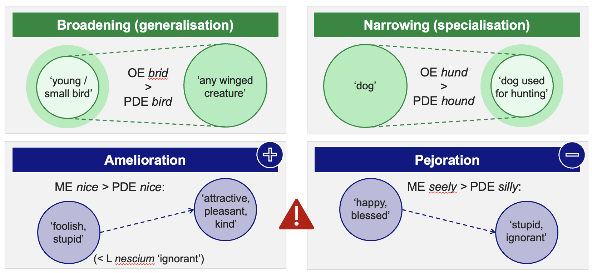


## Exercise

Match the following examples with the correct type of semantic change:

1. *nice*: ME *nice* 'foolish, absurd' (cf. L *nescium* 'ignorant') > PDE *nice*
    - [**amelioration**: meaning changed from negative ('foolish') to positive ('nice')]{.excl .fragment}
2. *holiday*: OE *halig-dæg* 'day of religious significance, Sunday' > PDE *holiday*
    - [**broadening (generalisation)**: meaning expanded from 'religious day' to 'any day off']{.excl .fragment}
3. *terrific*: EModE *terrific* 'causing terror' (< L *terrificus*) > PDE 'wonderful'
    - [**amelioration**: meaning changed from negative ('causing terror') to positive ('wonderful')]{.excl .fragment}
4. *skyline*: LModE *skyline* 'any horizon' > 'horizon decorated by skyscrapers'
    - [**narrowing (specialisation)**: meaning narrowed from 'any horizon' to 'horizon with skyscrapers']{.excl .fragment}


# Quiz

```{=html}
<div style="width:100%;display:flex;flex-direction:column;gap:8px;min-height:635px;">
<iframe src="https://wayground.com/embed/quiz/693f53d83834c3da2d2d3383" title="Semantics Review Quiz - Wayground" style="flex:1;" frameBorder="0" allowfullscreen></iframe>
</div>
```


# References

::: {#refs}
:::
