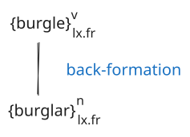
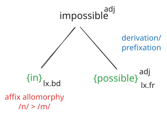
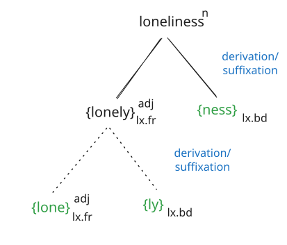
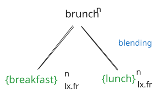

# Phonetics & Phonology

## What is the difference between vowels and consonants?

::: {.excl}
Vowels are articulated with an open vocal tract, the air flow is not obstructed. In the articulation of consonants the vocal tract is partially or completely closed, i.e. there is an obstacle that forms the flow of air.
:::

## Give an IPA transcription of the following words in isolated speech.

You can pick whether you transcribe in RP or GA. Please indicate which variant you're using.

|            | RP                     | GA                    |
|:-----------|:-----------------------|:----------------------|
| *outreach* | [/​ˈaʊt.riːtʃ​/]{.excl}  | [⟵]{.excl}           |
| *downcast* | [/​ˈdaʊn.kɑːst​/]{.excl} | [/ˈdaʊn.kæst/]{.excl} |
| *cup*      | [/kʌp/]{.excl}         | [⟵]{.excl}           |


## List the distinctive features of the following phonemes. 

For each, give an English word in which it occurs.

| Phnm  | Features                                         | Example           |
|:------|:-------------------------------------------------|:------------------|
| /p/   | [consonant, plosive, bilabial, voiceless]{.excl} | [*police*]{.excl} |
| /e/   | [vowel, front, half-open, short]{.excl}          | [*bet*]{.excl}    |
| /ɑː/  | [vowel, back, open, long]{.excl}                 | [*fast*]{.excl}   |
| /j/   | [consonant, approximant, palatal]{.excl}         | [*year*]{.excl}   |
| /əʊ/  | [diphthong, closing]{.excl}                      | [*pure*]{.excl}   |


# Morphology and word-formation

## Identify the word formation patterns that gave rise to the following words.

::: {.excl}
:::: {.callout-note}
Note that given how the question was phrased, it would be enough to just name the top-level word-formation process for each item, e.g. for (1): “back-formation”. I provide the trees only to give you more examples of full morphological analysis trees.
::::
:::

### *(to) burgle*

::: {.excl}

:::


### *impossible*

::: {.excl}

:::


### *loneliness*

::: {.excl}

:::


### *brunch*

::: {.excl}

:::


## What type of language is English from a morphological point of view? Explain.


## Explain the word-formation pattern of conversion and give two examples.


## Determine the types of morphemes in the following sentence.

*The queen likes to stay at Balmoral Castle and insists on going to Scotland once a year.*

::: {.excl}
| Morpheme    | Funct. | Distr. |
| :---------- | :----: | :----: |
| {The}       |   gr   |   fr   |
| {queen}     |  lex   |   fr   |
| {like}      |  lex   |   fr   |
| {plural}    |   gr   |   bd   |
| {to}        |   gr   |   fr   |
| {stay}      |  lex   |   fr   |
| {at}        |   gr   |   fr   |
| {Balmoral}  |  lex   |   fr   |
| {Castle}    |  lex   |   fr   |
| {and}       |   gr   |   fr   |
| {insist}    |  lex   |   fr   |
| {3rd pers.} |   gr   |   bd   |
| {on}        |   gr   |   fr   |
| {go}        |  lex   |   fr   |
| {ing}       |   gr   |   bd   |
| {to}        |   gr   |   fr   |
| {Scotland}  |  lex   |   fr   |
| {once}      |  lex   |   fr   |
| {a}         |   gr   |   fr   |
| {year}      |  lex   |   fr   |
:::


# Syntax

## Identify the syntactic functions and forms for the clause constituents in the following sentences.

An analysis of the immediate clause constituents is enough, no full analysis down to the word level required.

Example: *Last night the students were very drunk.*

```{.tikz}
%%| filename: last-night-the-students
\begin{forest}
  [sent
    [A: NP [Last night, roof]]
    [S: NP [the students, roof]]
    [V: VP [were]]
    [C$_s$: AdjP [very drunk, roof]]
  ]
\end{forest}
```

### *Recently the weather has been remarkably warm.*

::: {.excl}
```{.tikz}
%%| filename: recently-the-weather
\begin{forest}
  [sent
    [A: AdvP [Recently]]
    [S: NP [the weather, roof]]
    [V: VP [has been, roof]]
    [C$_S$: AdjP [remarkably warm, roof]]
  ]
\end{forest}
```
:::


### *My father has been reading a book on New York.*

::: {.excl}
```{.tikz}
%%| filename: my-father-reading
\begin{forest}
  [sent
    [S: NP [My father, roof]]
    [V: VP [has been reading, roof]]
    [O$_d$: NP [a book on New York, roof]]
  ]
\end{forest}
```
:::


### *I must send my parents an anniversary card.*

::: {.excl}
```{.tikz}
%%| filename: i-must-send
\begin{forest}
  [sent
    [S: NP [I]]
    [V: VP [must send, roof]]
    [O$_i$: NP [my parents, roof]]
    [O$_d$: NP [an anniversary card, roof]]
  ]
\end{forest}
```
:::


### *The professor’s office is on the fourth floor.*

::: {.excl}
```{.tikz}
%%| filename: professors-office
\begin{forest}
  [sent
    [S: NP [The professor’s office, roof]]
    [V: VP [is]]
    [A: PP [on the fourth floor, roof]]
  ]
\end{forest}
```
:::


### *Steve considers Kate a very good friend.*

::: {.excl}
```{.tikz}
%%| filename: steve-considers
\begin{forest}
  [sent
    [S: NP [Steve]]
    [V: VP [considers]]
    [O$_d$: NP [Kate]]
    [C$_o$: NP [a very good friend, roof]]
  ]
\end{forest}
```
:::


### *I met her at the corner of the street.*

::: {.excl}
```{.tikz}
%%| filename: i-met-her
\begin{forest}
  [sent
    [S: NP [I]]
    [V: VP [met]]
    [O$_d$: NP [her]]
    [A: PP [at the corner of the street, roof]]
  ]
\end{forest}
```
:::


### *Thousands of students go to university every morning.*

::: {.excl}
```{.tikz}
%%| filename: thousands-of-students
\begin{forest}
  [sent
    [S: NP [Thousands of students, roof]]
    [V: VP [go]]
    [A: PP [to university, roof]]
    [A: NP [every morning, roof]]
  ]
\end{forest}
```
:::

### *Alex ate the cake that I baked.*

::: {.excl}
```{.tikz}
%%| filename: alex-ate
\begin{forest}
  [sent
    [S: NP [Alex]]
    [V: VP [ate]]
    [O: NP [the cake that I baked, roof]]
  ]
\end{forest}
```
:::

## Provide a full syntactic analysis of the following sentence.

*He predicted that he would discover the tiny particle when he conducted his next experiment.*

::: {.excl}
```{.tikz}
%%| filename: he-predicted
\begin{forest}
  for tree={sealing}
  [sent
    [main cl
      [S: NP
        [head: pron [He]]
      ]
      [V: VP
        [mv: fv [predicted]]
      ]
      [O$_d$: \textit{that}-cl
        [sub conj
          [that]
        ]
        [S: NP
          [head: pron [he]]
        ]
        [V: VP
          [aux: modal [would]]
          [mv: fv [discover]]
        ]
        [O$_d$: NP
          [dtm: det [the]]
          [premod: adj [tiny]]
          [head: noun [particle]]
        ]
        [A: subord cl
          [sub conj
            [when]
          ]
          [S: NP
            [head: pron [he]]
          ]
          [V: VP
            [mv: fv [conducted]]
          ]
          [O$_d$: NP
            [dtm: det [his]]
            [premod: adj [next]]
            [head: noun [experiment]]
          ]
        ]
      ]
    ]
  ]
\end{forest}
```
:::