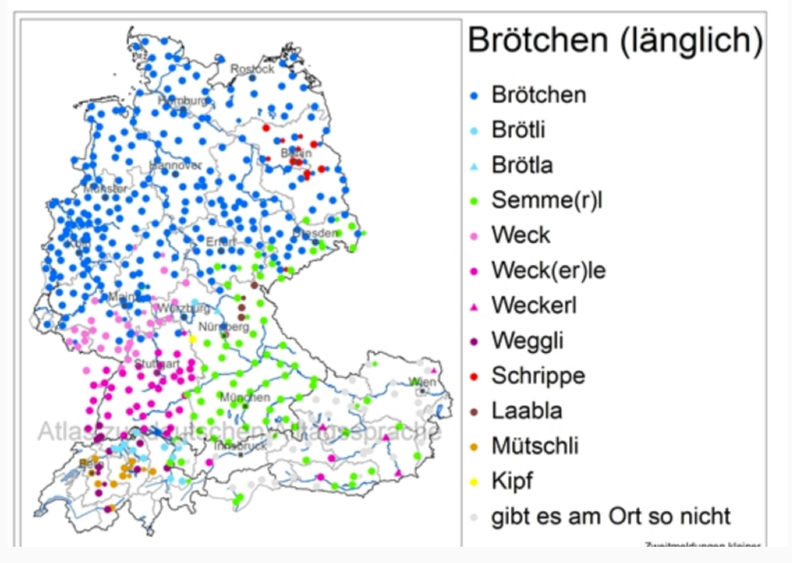
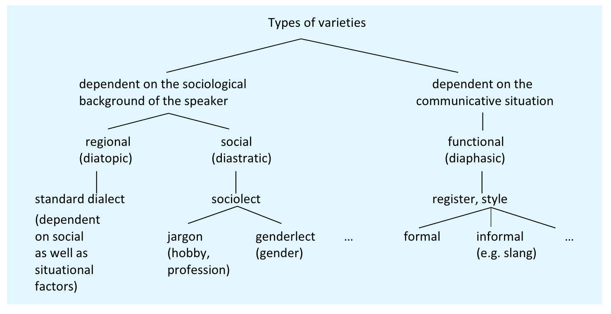
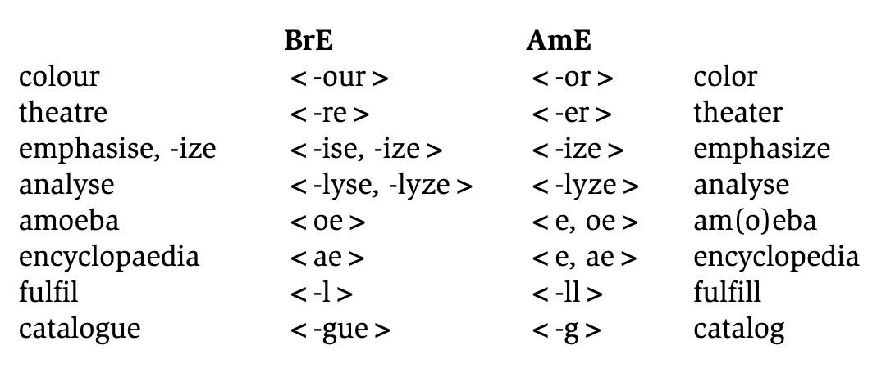
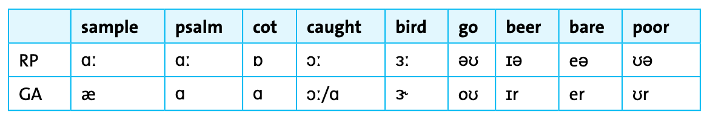
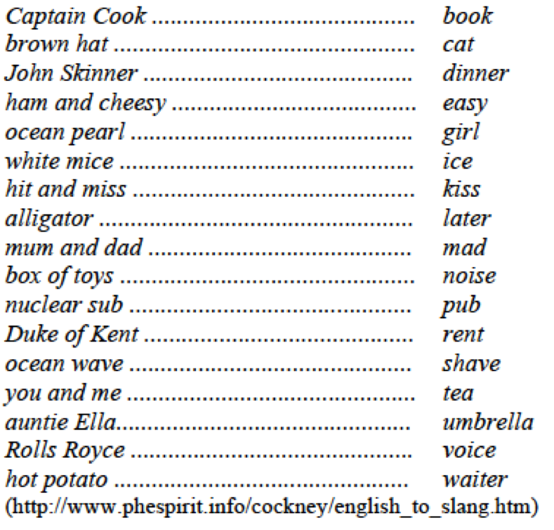

::: {.content-hidden when-format="revealjs"}
[Open slides](slides.html){.btn .btn-primary}
:::

# Introduction

What do you call these in German?

::: {.columns}
:::: {.column width="40%"}
{height=300}
::::
:::: {.column width="60%" .fragment}

::::
:::


# Object of study

## Definition

Sociolinguistics is a sub-discipline of linguistics concerned with the study of language in its **social context** – primarily of **linguistic variation** and the influence of **social factors** (ethnicity, social class, gender, age, profession etc.) on language use and language structure.

### Example research questions

1. How does social class affect the use of regional dialect features?
2. What language patterns distinguish different age groups on social media?
3. How do speakers switch between formal and informal registers?
4. What role does gender play in conversational turn-taking?


## Variation in language

- language characterized by a considerable amount of variation, that is, there are **different ways of expressing the same content or meaning**.
- variation either dependent on speaker or external factors
- the form of an utterance may depend on, e.g.:
    - whether the medium of expression is **spoken or written**
    - what is being discussed and whether **specialized vocabulary or terminology** is being used in the discussion
    - whether situation of an utterance is relatively **formal or informal**
    - the **regional and social background** of the speaker
    - whether the speaker's **gender** is male or female.


# Varieties and variation

## Variety

**Definition**: most general term used for a regionally, socially, functionally or otherwise specific form of a language

- umbrella term that includes dialects, sociolects, registers, and styles
- every speaker uses multiple varieties depending on context
- varieties can be distinguished by features at all linguistic levels (phonology, morphology, syntax, lexis)


## Standard

- used as an **official** language
- **prestigious** norm of a language
- codified in reference **grammars** and **dictionaries**
- propagated in the **educational system**
- used in **public** and in the **media** on formal occasions
- taught to foreign **learners**
- dominant variety in **writing**


## Dialect

- spoken in a certain region
- differs from the standard language in terms of pronunciation, morphology, syntax, vocabulary etc.
- typically not standardized or codified in writing
- **narrow definition**: regionally restricted variety
- **broad definition**: synonym for "variety" (e.g. *standard dialect*, *social dialect*)
- no dialect is inherently superior to any other [@Kortmann2020Essentials]


## Accent

- socially or regionally typical pronunciation
- deviations from the standard **only** with regard to pronunciation
- **dialect vs. accent**: dialect includes lexical and grammatical properties, accent only refers to pronunciation [@Kortmann2020Essentials]
- standard dialect + regional accent is possible; regional dialect + standard accent is not




## Overview: varieties and types of variation




## Sociolect, idiolect, and register/style {.small}

### Sociolect

- linguistic variety specific to a social class or **group**
- specific characteristics in pronunciation, morphology, syntax, vocabulary etc.
- **factors**: socio-economic status, level of education, profession, age, ethnicity, gender
- **examples**: 
    - **genderlects**: e.g. use of hedging, tag questions
    - **jargons**: e.g. legal: *pro bono*; medical: *stat*

---

### Idiolect

- spoken by an **individual person**
- each individual has their own idiolect that distinguishes them from others
- specific characteristics in pronunciation, morphology, syntax, vocabulary etc.
- **examples**: favourite phrases, unique word choices, pronunciation quirks

---

### Register/style

- variety determined by the **communicative situation or domain**, e.g. spoken or written in a certain usage event
- specific characteristics in pronunciation, morphology, syntax, vocabulary etc.
- **register**: determined by functional context (field, mode of discourse)
    - e.g. academic writing, legal language, medical consultations
- **style**: determined by individual choices and aesthetic preferences
    - e.g. formal vs. informal, colloquial vs. literary


## Diastratic variation

- **social variation:** complex phenomenon as speakers typically have one main geographically background, but belong to several social groups
- **factors motivating sociolects:** socio-economic status, level of education, profession, ethnicity, gender, age etc.
- **examples:**
    - working-class vs. middle-class speech patterns
    - youth language vs. adult language
    - professional jargon (lawyers, doctors, IT specialists)


# British vs. American English

## Speakers and status

- **General American (GA)**
  - Speakers: **≈ 70 %** of US population
  - Status: defined as **neutral variety**, not having features from Southern or Eastern accent
- **Received Pronunciation (RP)**
  - Speakers: **only 3–5 %** of the population (upper class)
  - Status: carries **high prestige**, not tied to specific region

## Lexical differences

. . .

### Examples

| Standard American | Standard English |
|------------------:|:-----------------|
| *fall*            | *autumn*         |
| *sideway*         | *pavement*       |
| *truck*           | *lorry*          |
| *mail*            | *post*           |
| *elevator*        | *lift*           |
| *gas*             | *petrol*         |
| *subway*          | *underground*    |

---

### Exercise

Decide for each of the following lexical items if they represent standard **AmE** or **BrE**. What is the equivalent in the other national variety?

::: {.columns}
:::: {.column width="50%"}
**Orthography**

a) *theater* [→ AmE]{.excl .fragment}
b) *colour* [→ BrE]{.excl .fragment}
c) *traveled* [→ AmE]{.excl .fragment}
::::
:::: {.column width="50%"}
**Lexis**

a) *petrol* [→ BrE]{.excl .fragment}
b) *fall* (n., 'Herbst') [→ AmE]{.excl .fragment}
c) *French fries* [→ AmE]{.excl .fragment}
::::
:::


## Orthographic differences

. . .




## Pronunciation differences

. . .

| General American (GA) | Received Pronunciation (RP) |
|---|---|
| /r/ pronounced in all positions (*car* /kaːr/, *card* /kaːrd/) | no postvocalic /r/ (*car* /kaː/, *card* /kaːd/); /r/ realized only before vowels |
| dark /l/ ([ɫ]) in all positions | clear [l] and dark [ɫ] as allophones of /l/ |
| /uː/ after /t, d, n, s, z, θ/ (*new* /nuː/) | /juː/ (*new* /njuː/) |
| /æ/ before nasals or voiceless fricatives (*dance* /dæns/) | /aː/ (*dance* /daːns/) |
| /ɑː/ (*hot* /hɑːt/) | /ɒ/ (*hot* /hɒt/) |
| /ba'llet/, /'cigarette/, /'address/ | /'ballet/, /ciga'rette/, /a'ddress/ |
| opposition between /t, d/ neutralized between vowels, resulting in tap sound [ɾ] (*latter* and *ladder* both pronounced [læɾər]) | |

---

### Vowel differences




## Regional and Social Variation in Accent and Dialect

- social class/socio-economic status (e.g. education, occupation, income level) of a speaker influences use of regional dialect forms
- in British English, accent with highest social prestige: RP → if someone speaks RP, no regional variation observable
- the lower the social class, the more probable is a high degree of regional variation


## Slang

- words or phrases used **instead of more conventional forms** as markers of membership in a particular group or certain occupational groups
- many creative word formations and **neologisms**
- slang words often have a **short life span**

### Example: 'rhyming slang'

- common words are substituted by phrases, consisting of two or three words, the last of which rhymes with the original word (which leads to a secret code)
- in a more advanced state, the second, rhyming elements of the phrases are deleted, which makes it almost impossible for an outsider to understand the meaning


## Cockney

::: {.columns}
::: {.column width="50%"}

:::
::: {.column width="50%"}

:::
:::

---

### Cockney exercise

What does the following Cockney slang mean?

1. *I'm just going down the [apples and pears]{.underline} to get a cup of tea from the kitchen.* [→ *stairs*]{.excl .fragment}
2. *Its the middle of winter and the sun came out today, can you [Adam and Eve]{.underline} it?* [→ *believe*]{.excl .fragment}
3. *The [trouble and strives]{.underline} been shopping again.* [→ *wife*]{.excl .fragment}
4. *Look who's on TV, its the [baked]{.underline}!* [→ *queen*]{.excl .fragment}
5. *Got to my [mickey]{.underline} safe.* [→ *house*]{.excl .fragment}
6. *Can you pick up the [teapot lids]{.underline}?* [→ *kids*]{.excl .fragment}


# Quiz

```{=html}
<div style="width:100%;display:flex;flex-direction:column;gap:8px;min-height:635px;">
<iframe src="https://wayground.com/embed/quiz/6964affe166eaf87d7ea068a" title="Sociolinguistics Quiz - Wayground" style="flex:1;" frameBorder="0" allowfullscreen></iframe>
</div>
```


# References

::: {#refs}
:::