::: {.content-hidden when-format="revealjs"}
[Open slides](slides.html){.btn .btn-primary}
:::

# Overview

## The Indo-European language family

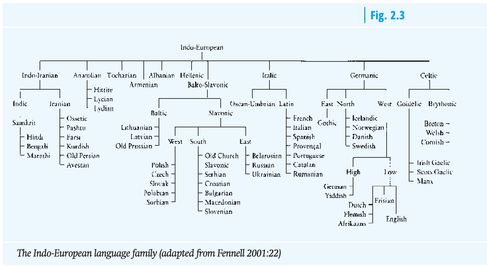


## Morphosyntactic types of languages

- **synthetic**: many inflections, many forms per lexeme, free word order
    - **inflecting**: (or fusional) one morpheme usually expresses a bundle of grammatical information (e.g. Latin, **Old English**)
    - **agglutinative**: one morpheme usually expresses one specific piece of grammatical information (e.g. Hungarian)
- **analytic**: few inflections, few forms per lexeme, many function words and periphrastic constructions, relatively rigid word order (e.g. **Modern English**)
    - **isolating**: no inflections, one form per lexeme (e.g. Mandarin Chinese)


## Periods of English

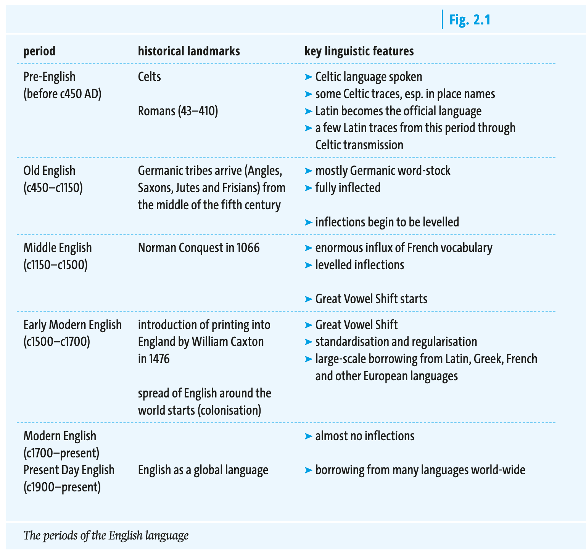


# Old English


## External history

- **from A.D. 410** (traditional date according to Bede's *Historia Ecclesiastica Gentis Anglorum*, 449): Angles, Saxons and Jutes (and probably some Frisians), speaking varieties of West Germanic languages, conquer the main British Isle (**"Germanic Conquest"**)
- **c. 700**: earliest written documents in Old English
- from **6th century**: **Christianization**
    - Irish missionaries (c. 563; St. Columba to Iona)
    - missionaries from Rome (c. 597; St. Augustine to Canterbury)
- from **8th century** onwards: **Viking raids and Danish settlement**
    - 793: sacking of Monastery of Lindisfarne
    - 878: establishment of the *Danelaw*


## Old English dialects

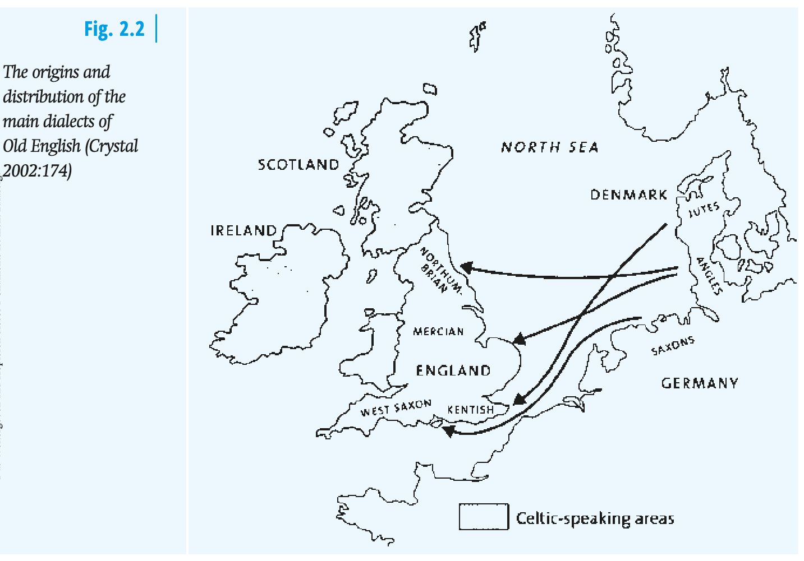


## Viking invasions

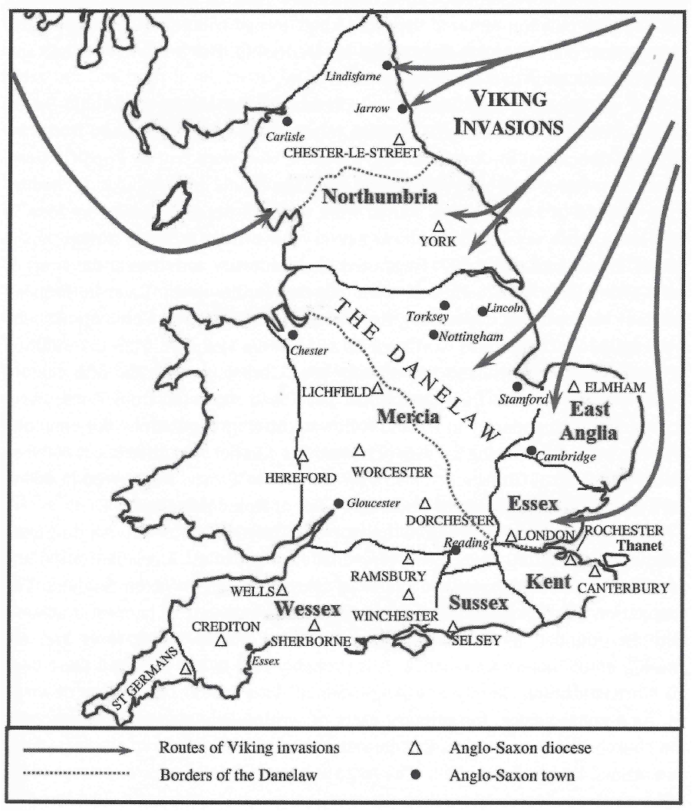


## The Futhorc alphabet

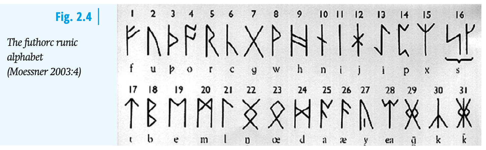


## Old English declensions

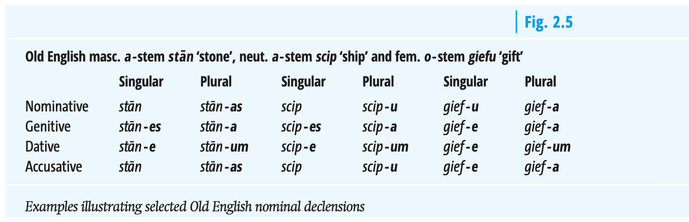


## Linguistic characteristics

- Germanic **vocabulary** (West Germanic "Erbwortschatz") with some Latin (e.g. *wine*, *cheese*, *street*) and Old Norse (e.g. *take*, *die*, *sky*) loanwords
- **word order** relatively free
- **inflecting/synthetic** language; e.g. adjectives and nouns inflect for 4 cases, 2 numbers, 3 grammatical genders
- **pronunciation**: strong differences to PDE 

Sound example:




## *i*-mutation (*i*-Umlaut) (c. 500/600)

- between Germanic and Old English; conditioned sound change
- Germanic back vowels got fronted (or palatalized), front vowels got raised by /i/ or /j/ in the following syllable
- remnants in PDE: *mouse* – *mice*, *foot* – *feet*, *louse* – *lice* etc.


## Germanic Erbwortschatz

Elements that survived from OE are basic elements of the vocabulary and are very frequent: pronouns, conjunctions, auxiliary verbs etc.

Fundamental concepts:

- oe. *mann* ‘man’
- oe. *wīf* ‘wife’
- oe. *cīld* ‘child’
- oe. *hūs* ‘house’
- oe. *drincan* ‘drink’
- oe. *libban* ‘live’


## Latin influence

- **continental** borrowings: *street*, *wine*, *kitchen*, *mile*, *butter*, *cheese*
- borrowings after **settlement of Britain** (after 450): *port*, *mount*, *-chester*
- borrowings during **Christianization**: *martyr,* *clerk,* *creed,* *nun,*, *verse*
- later borrowings: part. during **Renaissance**


## Old Norse influence

- Viking raids (‘Danelaw’)
- genetic resemblance between Old Norse and Old English
- strong influence on basic vocabulary:
    - function words: *they*, *them*, *their*; *though*
    - verbs: *to call*, *to die*, *to take*, *to raise*
    - nouns: *law*, *husband*, *egg*, *birth*
    - adjectives: *awkward*, *ill*, *weak*

**Consequence**: English drifts apart from West Germanic languages, e.g. German


# Middle English

## External history

- 1066: **Norman Conquest** (William the Conqueror; Battle of Hastings)
- for more than three centuries (mid–11th to mid–14th cent.), England was trilingual ('**Triglossia**'): (Anglo-)French and Latin as 'high variety' and English as 'low variety'
- from mid-14th century: English slowly re-established in various domains (1349 English as language of education, 1362 opening of Parliament, literary language) —> English re-introduced as **high variety**


## Language contact

Traces of linguistic **contact situations** can be found.

- with **Celtic**: little influence, mostly place names: *London*, *Dover*, *Kent*
- with **Latin**: in trade, place names and Christianisation: *priest*, *monk*, *school*
- with **French**: in government, art, justice, etc.: *administration*, *government*


## French influence {.small}

**Superstrate influence**: situation in which the language of a group of speakers in a socially or politically superior position influences that of the speakers in an inferior position [@Herbst2010English 316].

### Examples

**leisure/arts**: *art*, *beauty*, *chess*, *colour*, *dance*, *falcon*, *image*, *leisure*, *literature*, *melody*, *music*, *painting*, *pen*, *poet*, *preface*, *prose*, *recreation*, *rhyme*, *romance*, *sculpture*, *story*, *tragedy*, *volume*

**science**: *anatomy*, *calendar*, *gender*, *geometry*, *grammar*, *logic*, *medicine*, *metal*, *noun*, *pain*, *physician*, *poison*, *square*, *study*

**general nouns**: *action*, *adventure*, *age*, *air*, *city*, *comfort*, *courage*, *debt*, *envy*, *error*, *face*, *flower*, *hour*, *joy*, *labour*, *marriage*, *mountain*, *number*, *opinion*, *order*, *people*, *person*, *poverty*, *power*, *river*, *sign*, *unity*, *vision*

**general adjectives**: *active*, *blue*, *calm*, *certain*, *clear*, *cruel*, *curious*, *eager*, *easy*, *final*, *foreign*, *gentle*, *honest*, *horrible*, *large*, *natural*, *nice*, *perfect*, *poor*, *real*, *rude*, *safe*, *second*, *simple*, *single*, *special*, *sure*

**general verbs**: *advise*, *allow*, *carry*, *change*, *close*, *continue*, *cry*, *enjoy*, *enter*, *inform*, *join*, *marry*, *move*, *obey*, *pass*, *prefer*, *prove*, *quit*, *receive*, *refuse*, *remember*, *satisfy*, *save*, *serve*, *suppose*, *trip*


## Consequence: large, mixed vocabulary

- many **synonyms** —> fine nuances in meaning: *liberty* – *freedom*, *short* – *brief*
- **hard words** (‘inkhorn’ terms): *hippopotamus*
- weak relation between **orthography** and pronunciation
- **consociation** vs. **dissociation**: ger.: *Mund* – *mündlich*, en.: *mouth* – *oral*

### Consociation and dissociation

::: {#tbl-panel layout-ncol=2}
|            |             |
|------------|-------------|
| *Mund*     | *mündlich*  |
| *Heiliger* | *heilig*    |
| *Fuß*      | *Fußgänger* |
| *Wort*     | *wörtlich*  |
| *Buch*     | *Buchstabe* |

: Consociation

|         |              |
|---------|--------------|
| *mouth* | *oral*       |
| *saint* | *holy*       |
| *foot*  | *pedestrian* |
| *word*  | *verbal*     |
| *book*  | *letter*     |

: Dissociation

Consociation and dissociation
:::


## The Canterbury Tales

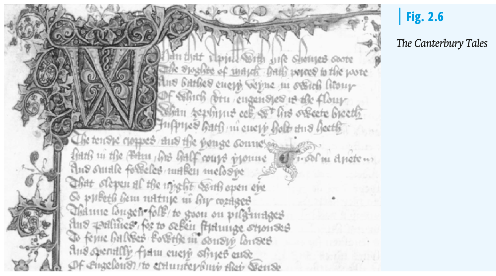


## Linguistic characteristics

::: {.r-fit-text}
- transition from a synthetic to a **more analytic** language (early Middle English) due to breakdown of inflection caused by weakening of final syllables ('Entsilbenabschwächung': /a/, /u/, /o/ > /ə/ > ∅)
- loss of grammatical **gender** at around 1200 (replaced by natural gender; article *the*)
- less flexibility in **word order**
- '**dialect age**': no generally accepted standard
- huge number of **borrowings** in the field of war/military, administration/law, religion/church, fashion, socials life etc. (+ influence on word formation and stress patterns) —> end of Middle English: mixed Germanic/Romance vocabulary
- **pronunciation**: see sound sample [on YouTube](https://www.youtube.com/watch?v=ahuT-JwxIa8)
- **triglossia**: from mid-11th to mid-14th century
    - high varieties
        1. Latin: church, learning, documents
        2. French: upper classes, feudal aristocracy
    - low variety:
        3. English: peasants, lower clergy, most people in the city
:::


## Exercise: spot the loanwords {.small}

**Read the following newspaper article and spot the loanwords.**

[Romance/Latin]{.green} — [Greek]{.blue} — [other/uncertain]{.purple}

**Scottish whale watchers' photos used to gain insights into animals' habits.**

Images taken by public reveal insights into threatened minke whales, including finding the most attention-seeking whale

Snowy is the oldest known minke whale in Europe, while Knobble appears to adore attention – or, at least, the whale has been spotted more than 60 times since 2002, mostly close to the Isle of Mull. Photographic records of minke whales submitted by members of the public are being published in a digital catalogue, providing insights about the threatened species. The research, collated by the Hebridean Whale and Dolphin Trust, reveals that more than 300 individual minke whales have been identified in the Hebrides since 1990. A third (33%) have been seen more than once. "Photographs are a powerful tool for strengthening our understanding of whale movements and the threats they face – providing vital evidence for effective conservation," said Dr Lauren Hartny-Mills, science and conservation manager for the Hebridean Whale and Dolphin Trust. […]

*[The Guardian, 26 October 2023](https://www.theguardian.com/environment/2023/oct/26/scottish-whale-watchers-photos-used-to-gain-insights-into-animals-habits)*


### Solution {.excl .slide}

::: {.small}
**Scottish whale watchers’ [photos]{.blue} [used]{.green} to gain insights into [animals’]{.green} [habits]{.green}.**

[Images]{.green} taken by [public]{.green} [reveal]{.green} insights into threatened [minke]{.purple} whales, [including]{.green} finding the most [attention]{.green}-seeking whale

Snowy is the oldest known [minke]{.purple} whale in [Europe]{.blue}, while Knobble [appears]{.green} to [adore]{.green} [attention]{.green} – or, at least, the whale has been spotted more than 60 times since 2002, mostly [close]{.green} to the [Isle]{.green} of [Mull]{.purple}. [Photographic]{.blue} [records]{.green} of [minke]{.purple} whales [submitted]{.green} by [members]{.green} of the [public]{.green} are being [published]{.green} in a [digital]{.green} [catalogue]{.blue}, [providing]{.green} insights about the threatened [species]{.green}. The [research]{.green}, [collated]{.green} by the [Hebridean]{.purple} Whale and [Dolphin]{.purple} Trust, [reveals]{.green} that more than 300 [individual]{.green} [minke]{.purple} whales have been [identified]{.green} in the [Hebrides]{.purple} since 1990. A third (33%) have been seen more than once. “[Photographs]{.blue} are a [powerful]{.green} tool for strengthening our understanding of whale [movements]{.green} and the threats they [face]{.green} – [providing]{.green} [vital]{.green} [evidence]{.green} for [effective]{.green} [conservation]{.green},” said Dr Lauren Hartny-Mills, [science]{.green} and [conservation]{.green} [manager]{.green} for the [Hebridean]{.purple} Whale and [Dolphin]{.purple} Trust. […]
:::


# Early Modern English

## External history

- 1476: William Caxton introduces **printing press** to England
- **Renaissance and Humanism** 'new cultural climate': rediscovery of classical authors and literature
- 1534: **Reformation**
- growing **literacy**


## Linguistic characteristics

- **Great Vowel Shift** (from c. 1400/1500) marks the end of Middle English: raising and diphthongization of Middle English long vowels and diphthongs —> increasing discrepancy between phonemes and graphemes
- **weakening/loss of inflections** further continues
- **word order** becomes fixed: SVO
- development of London dialect into a **new standard**
- emergence of **standardized orthography**
- learned **loanwords** from Latin and Greek ('hard words') —> further mixing of vocabulary


## Borrowings

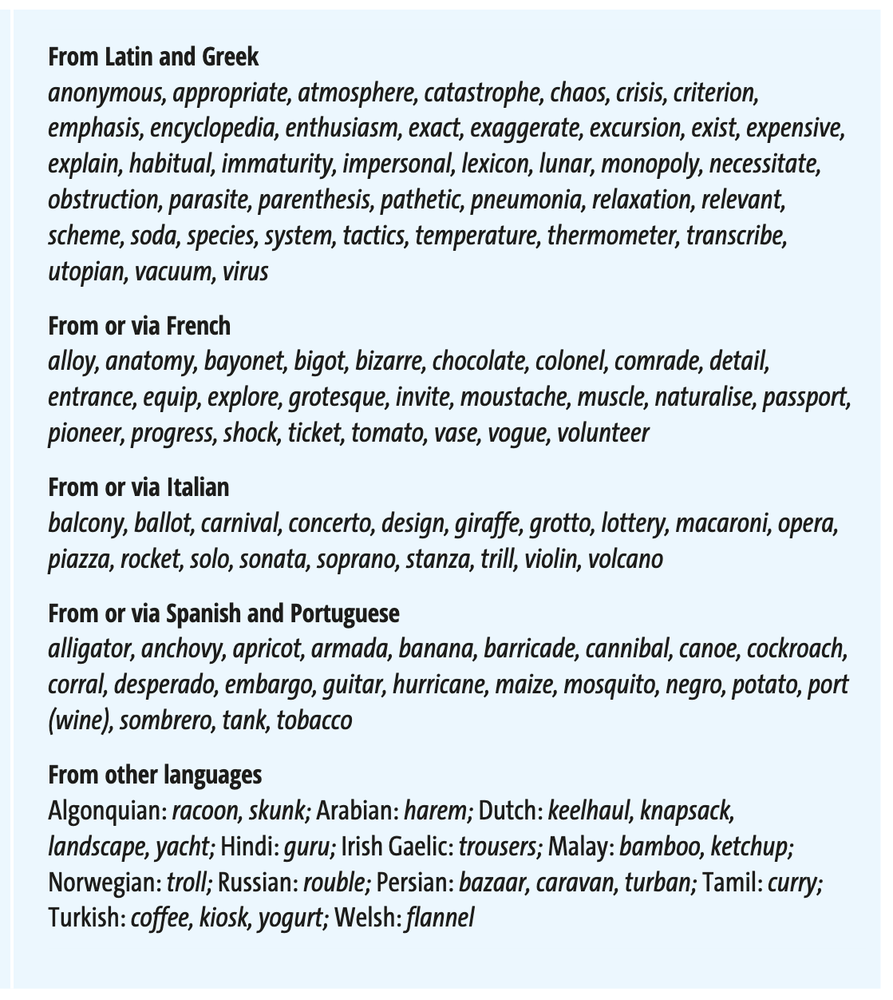


## The Great Vowel Shift

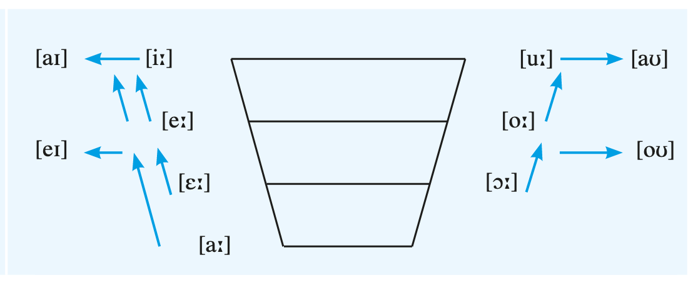

- sound change that affects all Middle English long vowels, which are either raised or diphthongized
- leads to the discrepancy between PDE orthography and pronunciation (English spelling had widely been fixed by the time the GVS set in)


# Present-Day English

## External history

- new **media** (telephone, TV, internet etc.)
- after WWI and WWII: increasing importance of **American English**
- English as a world language and a **lingua franca**
- increasing importance of **Postcolonial Englishes** (e.g. Indian English)


## Example: Bible translations 

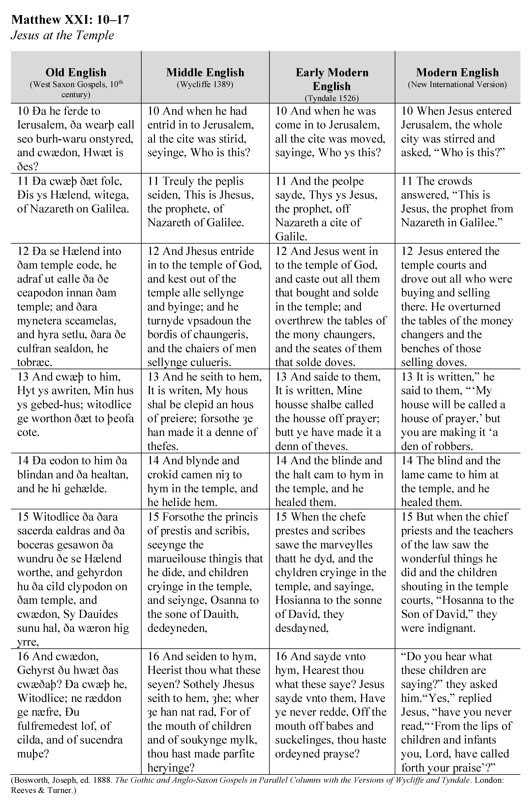{width=2000}


## Modern English Inflections

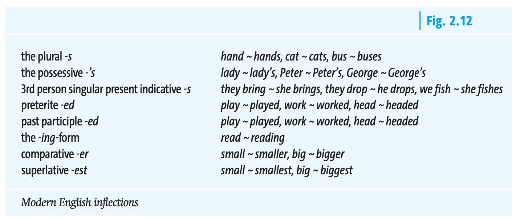


# English around the world

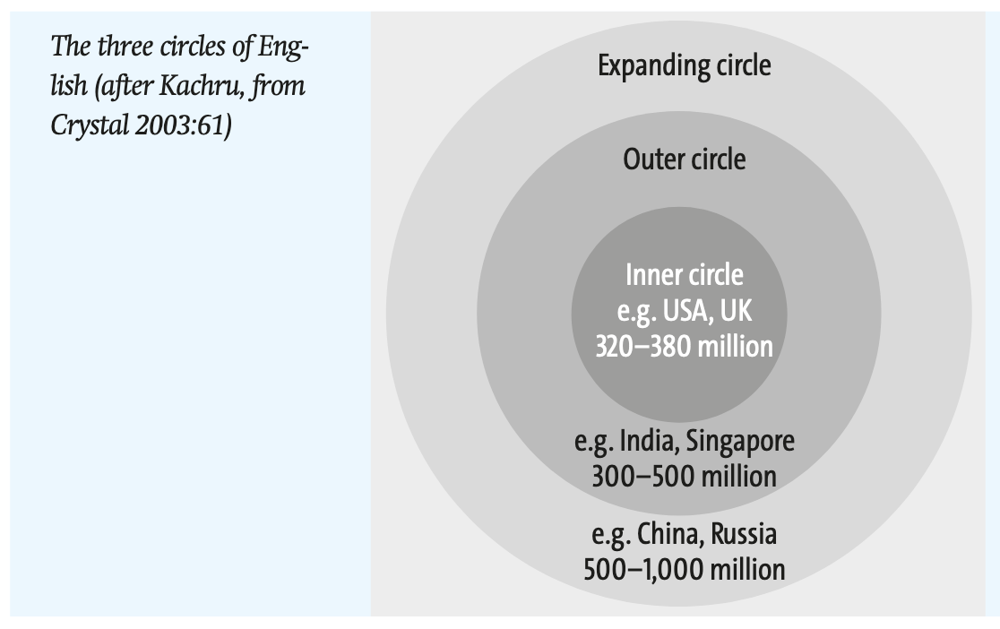


# Quiz: History of English

```{=html}
<div style="width:100%;display:flex;flex-direction:column;gap:8px;min-height:635px;">
<iframe src="https://wayground.com/embed/quiz/696d5bd264fc5a49718b7786" title="History of English Quiz - Wayground" style="flex:1;" frameBorder="0" allowfullscreen></iframe>
</div>
```


# References

::: {#refs}
:::